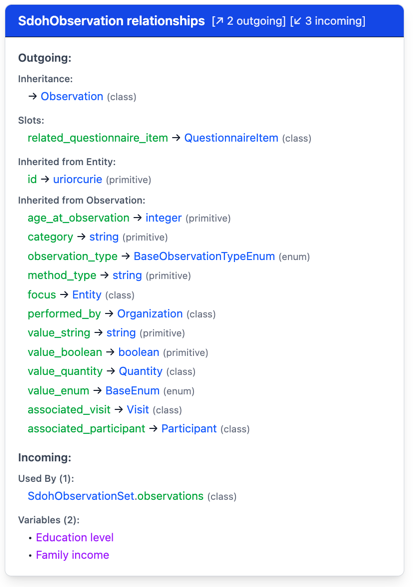

# CLAUDE.md - Development Tasks & Context

> **Purpose**: Document upcoming tasks and discussions needed to specify them
>
> **IMPORTANT**: Review [README.md](README.md) for architecture philosophy, design patterns, and technical context before starting work
>
> **Structure**: See [DOC_CONVENTIONS.md](DOC_CONVENTIONS.md) for documentation organization conventions

---

## Tasks from Conversation

_(Empty - use [PLAN] prefix to add tasks here before implementing them)_

---

## Quick Items

- 📖 Move doc files to docs directory
  - Make `docs/images/temp/` for files like img.png that illustrate ephemeral issues
  - Store images that will be used ongoingly (in README mostly) in `docs/images/`
- 🪲 Clicking class brings up detail box with gray title bar saying "Variable:" and missing the slots section (last worked at ecd4828, though blue color was slightly off from C icon color)

---

## Questions & Decisions Needed

### Boss Question: Variable Treatment for Condition Class

**Context**: My boss said that "variables" for Condition should be treated differently.

**Her explanation**:
> I think I made a mistake by calling "asthma" and "angina" variables. BMI is a variable that is a Measurement observation. We can think of BMI as a column in a spreadsheet. We wouldn't have a column for "asthma" - we would have a column for conditions with a list of mondo codes for the conditions present. This becomes more important when we are talking about the "heart failure" and "heart disease" columns. Where does one draw lines? The division of conditions into variables/columns might be ok if all we're looking at is asthma and angina, but quickly gets too hard to draw lines.

**My question**: I still don't understand. Do you? Can you try to explain?

---

## Current Phase: ✅ 🪲 Fix DetailPanel Tests & Bug

### Fix DetailPanel Tests (10 failing)

**Status**: Tests created, need to update expectations to match actual rendering

**What's failing**: 10/26 tests in DetailPanel.test.tsx
- Test expectations don't match actual rendered text
- Example: Expected "Class" label, actual shows "extends ParentClass"
- Example: Expected "Inherits from:", actual shows "extends"

**Action**: Update test expectations to match what DetailPanel actually renders. This will establish baseline for catching future regressions (like slots disappearing bug).

**Note**: Other tests are also failing:


---

## Upcoming Work

Listed in intended implementation order (top = next):

### ✨ Give Right-Side Stacked Detail Panels Same Features as Floating Dialogs

**Goal**: Feature parity between stacked panels (wide screens) and floating dialogs (narrow screens)
**Importance**: Low - minor UX polish, not a major feature

**Missing features in stacked panels**:
- TBD: Need to compare and document differences

---

### 🔄 Move renderItems to Section.tsx

#### a. Complete getRenderableItems() Implementation

**Goal**: Finish converting collections from renderItems() to getRenderableItems() pattern

**Status**:
- ✅ EnumCollection done
- ✅ SlotCollection done
- ⏳ ClassCollection pending
- ⏳ VariableCollection pending

**ClassCollection challenges**:
- Currently stores ClassNode[] tree structure
- Need to flatten tree with level tracking
- Maintain expansion state handling
- Return RenderableItem[] with proper isClickable flags

**VariableCollection challenges**:
- Currently groups variables by class in renderItems()
- Need to pre-group during data load (move logic to dataLoader.ts)
- Variable group headers use actual ClassElement instances (decision made)
- Group headers: isClickable=false (expand/collapse only)
- Variables: isClickable=true (open dialog)

**Files to modify**:
- `src/models/Element.tsx` - ClassCollection and VariableCollection implementations
- `src/utils/dataLoader.ts` - Move variable grouping logic here

#### b. Update Section.tsx to Render RenderableItems

**Goal**: Remove type-specific rendering logic from Section.tsx, use generic RenderableItem rendering

**Current state**: Section.tsx calls `collection.renderItems()` which returns JSX
**Target state**: Section.tsx calls `collection.getRenderableItems()` which returns data, Section renders it

**Implementation**:
```typescript
function Section() {
  const items = collection.getRenderableItems(expandedItems);

  return items.map(item => (
    <ItemDisplay
      item={item}
      onClick={item.isClickable ? () => onSelect(item.element) :
               item.hasChildren ? () => toggleExpansion(item.id) :
               undefined}
    />
  ));
}
```

**Benefits**:
- Section doesn't need type-specific conditionals
- Collections define structure as data, not React rendering
- Easy to add new element types

**Files to modify**:
- `src/components/Section.tsx`
- Create new component: `src/components/ItemDisplay.tsx` (or inline in Section)

#### c. Remove renderItems() Method

**Goal**: Delete obsolete renderItems() after Section uses getRenderableItems()

**Files to modify**:
- `src/models/Element.tsx` - Remove renderItems() from all 4 collection classes

---

### 🔄 Collections Store Elements (Not Raw Data)

**Goal**: Eliminate redundant wrapping - collections should store Element instances, not raw data

**Remaining conversions**:
1. **SlotCollection** - Convert to store SlotElement instances
2. **VariableCollection** - Convert to store VariableElement instances
3. **ClassCollection** - Convert to store ClassElement instances (tricky: currently stores ClassNode[] tree)

**Then cleanup**:
4. Pre-compute relationships - Move getRelationships() into Element constructors, store as readonly property
5. Remove createElement() factory - No longer needed once collections store Elements
6. Remove getElementName() helper - Use element.name directly (already works via polymorphism)
7. Replace categorizeRange() duck typing - Use elementLookup map instead of checking if name ends with "Enum"
8. Remove ElementData type - Once collections store Elements, this union type becomes obsolete

**Files to modify**:
- `src/models/Element.tsx`
- `src/utils/dataLoader.ts`
- `src/types.ts` (remove ElementData)

---

### 🔄 Split Element.tsx into Separate Files

**Current state**: Element.tsx is 919 lines with 4 element classes + 4 collection classes

**Target structure** (keep element class with its collection class in same file):
- `models/Element.ts` (base Element and ElementCollection classes)
- `models/ClassElement.ts` (ClassElement + ClassCollection)
- `models/EnumElement.ts` (EnumElement + EnumCollection)
- `models/SlotElement.ts` (SlotElement + SlotCollection)
- `models/VariableElement.ts` (VariableElement + VariableCollection)
- `models/index.ts` (barrel export)

**Benefits**:
- Each element/collection pair stays together (easier to maintain)
- Smaller, more focused files
- Easier to understand each element type in isolation

---

### 🔄 Refactor App.tsx

**Current state**: App.tsx is 600+ lines, too long

**Extract logic into hooks**:
- `hooks/useModelData.ts` - Data loading
- `hooks/useDialogState.ts` - Dialog management
- `hooks/useLayoutState.ts` - Panel layout + expansion state (consolidate useExpansionState)
- Keep App.tsx focused on composition

**Additional cleanup**:
- Consolidate expansion state: Move from useExpansionState hook into statePersistence.ts
- Remove dead code: Delete evc/ecn params from statePersistence.ts (replaced by lve/rve/lce/rce)

**Files to create**:
- `src/hooks/useModelData.ts`
- `src/hooks/useDialogState.ts`
- `src/hooks/useLayoutState.ts`

**Files to modify**:
- `src/App.tsx`
- `src/utils/statePersistence.ts`

---

## Future Ideas (Unprioritized)

### 🔴 ✨ Search and Filter

**Potential importance**: High - major usability feature for exploring large schemas

**Search functionality**:
- Search bar with full-text search across all elements
- Highlight search results in tree/sections
- Quick navigation: search results open in new dialogs

**Filter controls**:
- Checkboxes for class families
- Variable count slider
- Relationship type toggles

---

### 🟡 ✨ Neighborhood Zoom

**Potential importance**: Medium - useful for focused exploration

**Focus mode**:
- Show only k-hop neighborhood around selected element
- Relationship type filters ("show only `is_a` relationships" vs "show associations")
- Breadcrumb trail showing navigation path
- "Reset to full view" button

---

### ✨ Enhanced Element Metadata Display

Show additional relationship counts in tree view:
- **Current**: Only variable count (e.g., "Condition (20)")
- **Desired**: "Condition (20 vars, 5 enums, 2 classes, 1 slot)"

---

### ✨ Custom Preset Management

User-managed presets replacing hard-coded ones:
- Save Preset button → prompts for name
- Saves current panel configuration (sections + dialogs) to localStorage
- Display saved presets in header with remove icons

---

### ✨ Advanced Overview

Multiple view modes and analytics:
- Tree view (current)
- Network view (force-directed graph for associations)
- Matrix view (class-enum usage heatmap)
- Mini-map showing current focus area
- Statistics dashboard

---

### 🔴 🪲 Fix Dark Mode Display Issues

**Goal**: Fix readability issues in dark mode
**Importance**: High - app currently unusable in dark mode
**Timeline**: Complete by end of week

**Issues from screenshot**:
- Poor contrast/readability throughout
- Need to audit all color combinations

**Files likely affected**:
- `src/index.css` - Tailwind dark mode classes
- All component files using colors

---

### 📖 Terminology Consistency

**Goal**: Use consistent terminology throughout app
**Importance**: Low - internal consistency improvement

**Problem**: Still using "Property" to denote attributes and slots

**Action needed**:
- Use "Attribute" and "Slot" consistently
- Document terminology guidelines below to prevent regression

**Terminology guidelines**:
- ✅ **Attribute** or **Slot** - NOT "Property"
- ✅ **Element** - NOT "Entity" (entity was old term)
- ✅ **Class**, **Enum**, **Slot**, **Variable** - Capitalize when referring to element types

**Terminology configuration**:
- It might be better for some people to see "<current class> is_a <base class>" and other people to see "<current class> inherits from <base class>". Allow that to be a (probably) user-configurable option.
- I don't know how software with internationalization capabilities handle this, or with configurable display themes, but we could try similar approaches.

---

### ✨ External Link Integration

**Goal**: Link prefixed IDs to external sites (OMOP, DUO, etc.)

**Implementation**:
- Use prefix data from bdchm.yaml
- Make CURIEs clickable in variable details
- Add tooltip showing full URL before clicking

---

### ✨ Feature Parity with Official Docs

Reference: https://rtiinternational.github.io/NHLBI-BDC-DMC-HM/

Missing features:
1. **Types** - Import and display linkml:types
2. **Dynamic enums** - Show which enums are dynamic
3. **LinkML Source** - Collapsible raw LinkML view
4. **Direct and Induced** - Show direct vs inherited slots
5. **Partial ERDs** - Visual relationship diagrams

---

### 📖 GitHub Issue Management

Issue: https://github.com/RTIInternational/NHLBI-BDC-DMC-HM/issues/126
- Make issue more concise
- Add subissues for specific features (ASK FIRST)

---

### ⚡ Performance Optimizations

When working with larger models or slower devices:
- **Virtualize long lists**: MeasurementObservation has 103 variables; consider react-window or react-virtual
- **Viewport culling for links**: Only render SVG links for visible elements
- **Animation library**: Consider react-spring for smoother transitions (current CSS transitions work fine)

---

## Open Architectural Questions

### Where Should Element Type Metadata Live?

**Status**: Deferred - keeping ElementRegistry.ts for now (working well)

**Current approach**:
- Separate `ElementRegistry.ts` file with:
  - `ELEMENT_TYPES` map: colors, labels, icons, pluralLabel per type
  - `RELATIONSHIP_TYPES` map: relationship metadata
  - Helper functions: `getAllElementTypeIds()`, `isValidElementType()`
- Element classes import from registry: `ELEMENT_TYPES[this.type]`

**Alternative approach**: Put metadata directly in element classes as static properties

**Tradeoffs**:
- **Current (separate registry)**: All metadata in one place, easy overview, clear separation
- **Alternative (in classes)**: Better cohesion, less indirection, but scattered across files

**Decision**: Keep current approach until there's a compelling reason to change

---

## Implementation Notes & Lessons Learned

### LinkML Metadata Structure

**Bug fix reference**: DetailView.tsx originally looked for `propDef.type` (JSON Schema convention) but LinkML metadata uses `propDef.range` for type information.

**Attribute structure in `bdchm.metadata.json`**:
```json
{
  "classes": {
    "Specimen": {
      "attributes": {
        "specimen_type": {
          "range": "SpecimenTypeEnum",
          "description": "...",
          "multivalued": false,
          "required": false
        }
      }
    }
  }
}
```

Key fields:
- `range`: The type (primitive, enum name, or class name)
- `multivalued`: Boolean indicating array vs single value
- `required`: Boolean for required attributes
- `description`: Free text

---

### Structural vs Semantic Categorization

**Current approach** (structural - safe from schema changes):
- Categorize by `range` value:
  - **Primitive**: Known set (`string`, `integer`, `float`, etc.)
  - **Enum**: Range ends with `Enum`
  - **Class**: Everything else
- Filter/toggle by entity type: class, enum, slot, variable

**DO NOT hard-code semantic categories** like "containment" vs "association" vs "activity" - these could break with schema updates.

---

### REMINDER: Semantic Insights for Future Use

The following **semantic relationship patterns** were identified during analysis and could be valuable for:
- User-facing documentation/tooltips
- Search result grouping
- Suggested exploration paths
- AI-assisted query answering

**Semantic patterns identified**:

1. **Containment/Part-of**: `parent_specimen`, `parent_container`, `part_of`
2. **Association**: `associated_participant`, `source_participant`, `performed_by`
3. **Activity/Process**: `creation_activity`, `processing_activity`, `storage_activity`
4. **Measurement**: `value_quantity`, `range_low`, `range_high`, `quantity_measure`
5. **Provenance**: `*_provenance`, `derived_from`
6. **Organization/Study**: `member_of_research_study`, `originating_site`

**Potential future features using semantic patterns**:
- "Show specimen workflow" - follow activity relationships
- "Show participant data" - trace associated_participant links
- "Explain this class" - generate natural language description using relationship semantics
- Smart search: "find containment relationships" could match `parent_*` and `part_of` patterns

**Implementation approach when ready**:
- Extract patterns from attribute names (regex/keyword matching)
- Make patterns configurable (JSON/YAML file of patterns)
- Use for suggestions/enhancements, not core functionality
- Keep structural navigation as primary interface
