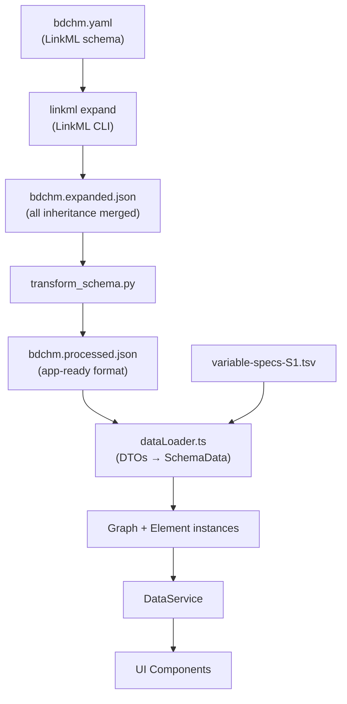

# Architecture

> Technical architecture and design decisions.
> For development rules, see [CLAUDE.md](../CLAUDE.md).
> For tasks and roadmap, see [TASKS.md](../TASKS.md).

---

## Tech Stack

- **Frontend**: React 18 + TypeScript + Vite
- **Styling**: Tailwind CSS
- **Testing**: Vitest + React Testing Library
- **Data**: LinkML schema (YAML) + TSV variable specifications
- **Graph**: [graphology](https://graphology.github.io/) library
- **Visualization**: Native SVG with gradient definitions
- **State Management**: React Hooks + URL parameters + localStorage

---

## Architecture Philosophy: Shneiderman's Mantra

**"Overview First, Zoom and Filter, Details on Demand"**

This principle guides the UX design:

**1. Overview First** — Show model topology with all relationship types visible:
- Class inheritance tree (hierarchical view)
- Class→Enum usage patterns (which classes use which value sets)
- Class→Class associations (domain relationships)
- Slot definitions shared across classes

**2. Zoom and Filter** (future enhancements):
- Full-text search across classes, variables, enums, slots
- Faceted filtering (class type, variable count, relationship type)
- k-hop neighborhood view (show only elements within N steps of focal element)
- Relationship type filters (show only `is_a` vs show associations)

**3. Details on Demand** — Progressive disclosure:
- Click to open detailed views
- Show class definitions, descriptions, attributes, slots
- Display variable specifications with data types and units
- Show inheritance chains with attribute overrides
- Bidirectional navigation between related elements

---

## Data Flow Overview

> **Note**: The Python transform step is planned to change — we intend to use
> LinkML's `SchemaView` / `induced_slot()` from Python `linkml-runtime` to
> correctly resolve per-class slot definitions. See [TASKS.md](../TASKS.md).

### Key files in the pipeline

| File | Role |
|------|------|
| `scripts/transform_schema.py` | Transforms expanded LinkML JSON into app-specific format |
| `src/input_types.ts` | TypeScript DTOs matching the processed JSON shape |
| `src/utils/dataLoader.ts` | Loads JSON/TSV, transforms DTOs → domain types (`SchemaData`) |
| `src/models/SchemaTypes.ts` | Domain types used after transformation (`SlotData`, `ClassData`, etc.) |
| `src/models/Element.ts` | Domain model classes (`ClassElement`, `SlotElement`, etc.) |
| `src/services/DataService.ts` | API layer between model and UI |
| `src/components/` | React components (must only use `Element` and `DataService`) |

---

## LinkML Concepts

### Slots, Attributes, and Slot Usage

LinkML has three mechanisms for associating properties with classes:

1. **Top-level slots** (`slots:` section) — Reusable, first-class property definitions. Multiple classes can reference the same slot.

2. **Inline attributes** (`attributes:` on a class) — Class-owned property definitions. From LinkML docs: *"Attributes are really just a convenient shorthand for being able to declare slots 'inline'."* Despite the syntactic sugar, LinkML internally treats same-named attributes on different classes as **distinct slots** (mangled as `class__slot`).

3. **Slot usage** (`slot_usage:` on a class) — Refinements of an existing slot for a specific class context. Adds constraints (narrower range, required, etc.) without creating a new slot.

### Induced Slots

The canonical way to get a slot's effective definition for a specific class is LinkML's **induced slot** concept (`SchemaView.induced_slot(slot_name, class_name)`). It merges all layers:

1. `slot_usage` and `attributes` on the target class
2. Mixin class contributions
3. Parent class (`is_a`) contributions, recursively
4. Top-level slot definition
5. Schema defaults

All LinkML generators (JSON Schema, Python, Pydantic) use `class_induced_slots()` to get per-class definitions.

### Known Issue: Conflicting Inline Attributes

Our current `transform_schema.py` creates one slot entry per unique name. When multiple classes define the same attribute name with different descriptions or ranges, the **first class encountered wins** and the rest are silently dropped (with a stderr warning).

This affects **20 of 43 shared attributes**, including `quantity` (3 classes, different ranges and descriptions), `category` (10 classes), `observations` (4 classes), `value` (6 classes), and others.

The planned fix is to use `induced_slot()` from Python `linkml-runtime` in the transform step to produce per-class slot definitions. See [TASKS.md](../TASKS.md).

---

## Graph Architecture (Slots-as-Edges)

Graph model using graphology with slots serving dual roles.

**Nodes:**
- **Classes**: Entity, Specimen, Material, etc.
- **Enums**: SpecimenTypeEnum, AnalyteTypeEnum, etc.
- **Slots**: All slot definitions (~170 in BDCHM), browsable in middle panel only
- **Types**: Primitives (string, integer) and custom types
- **Variables**: Appear in detail boxes and relationship hovers, not as panel sections

**Edges:**
- **Inheritance**: Class → Parent Class (is-a)
- **Slot**: Class → Range (Class | Enum | Type) through a slot
  - Properties: slotName, slotDefId, required, multivalued, inheritedFrom
  - Multiple edges can reference same SlotElement (e.g., inherited with overrides)
- **MapsTo**: Variable → Class associations

**Three-Panel Layout:**
- **Left Panel**: Classes (always visible tree hierarchy)
- **Middle Panel**: Slots (toggleable)
- **Right Panel**: Ranges (Classes, Enums, Types as range targets)

When middle panel is visible, Class→Range slot edges decompose into two visual links: Class→Slot→Range.

---

## Architecture Patterns

**Element-Based Architecture**:
- Base `Element` class with subclasses: `ClassElement`, `EnumElement`, `SlotElement`, `VariableElement`
- Each element knows its name, type, and relationships
- `ElementRegistry` centralizes type metadata (colors, labels, icons)

**Collection Pattern**:
- Each element type has a corresponding collection class
- Collections stored in `Map<ElementTypeId, ElementCollection>`
- Generic interfaces enable type-safe iteration

**Generic Tree Types**:
- `Tree<T>` and `TreeNode<T>` for hierarchical data
- Reusable for class hierarchies and variable groupings
- Generic operations: `flatten()`, `find()`, `getLevel()`, `map()`

**RenderableItem Interface**:
- Separates data structure from presentation
- Collections provide `getRenderableItems()` returning structure metadata
- UI components render generically without type-specific logic

---

## DTOs vs Domain Models vs DataService

> **Note**: This layering is likely to simplify as we integrate `linkml-runtime`.
> See [TASKS.md](../TASKS.md).

**Current layers:**
- **DTOs** (`input_types.ts`): Raw data shapes matching JSON/TSV files
- **Domain types** (`models/SchemaTypes.ts`): Transformed types (`SlotData`, `ClassData`, etc.)
- **Domain models** (`models/Element.ts`): Classes with behavior (`ClassElement`, `SlotElement`, etc.)
- **DataService** (`services/DataService.ts`): API layer between models and UI

**Flow**: DTOs → dataLoader transforms → domain types → Element instances → DataService → UI

**Completed refactoring:**
- `types.ts` → `input_types.ts` (clarify as DTOs)
- UI types (`ItemInfo`, `EdgeInfo`, `DetailSection`) → `ComponentData.ts`
- `import_types.ts` imported only by dataLoader, Element, SchemaTypes, and tests

### Element Identity: .name vs getId()

Use `.name` for display, `getId()` for identity/comparisons.

| Method | Use for |
|--------|---------|
| `.name` | Display (titles, labels, sorting) |
| `getId()` | Identity comparisons, relationship data structures |
| `getId(context)` | DOM IDs needing panel-specific uniqueness |
