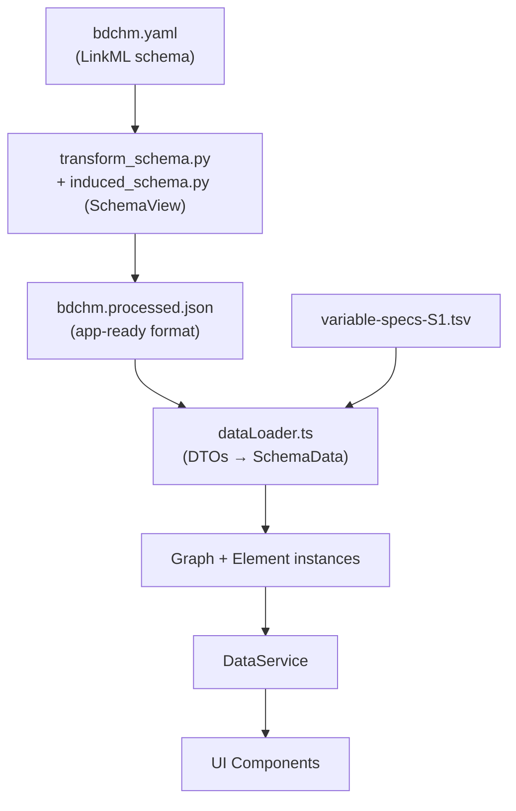

# Architecture

> How the app is put together, and why the diagram looks the way it does.
> Development rules: [CLAUDE.md](CLAUDE.md) · Open work: [TASKS.md](TASKS.md) ·
> What an edge *means*:
> [OWNERSHIP_CLASSIFICATION.md](OWNERSHIP_CLASSIFICATION.md) (how it is *drawn*
> is [below](#how-the-diagram-is-drawn))

Long reference sections are collapsed. Open the one you need.

---

## Tech Stack

- **Frontend**: React 18 + TypeScript + Vite
- **Styling**: Tailwind CSS
- **Testing**: Vitest + React Testing Library, plus one Playwright spec for popover placement
- **Data**: LinkML schema (YAML) + TSV variable specifications
- **Graph**: [graphology](https://graphology.github.io/), plus
  [`supergroup@2`](https://www.npmjs.com/package/supergroup) for the ownership DAG
- **Layout**: ELK (elkjs) in a web worker
- **Visualization**: HTML nodes over an SVG edge layer
- **State**: React hooks + URL parameters + localStorage

---

## Two apps: the Explore SPA (default) and the previous app

Since 2026-08-12 there are **two Vite entry points**:

- **`index.html` → `src/explore/`** — the Explore SPA, now the default app.
  Selection table + layered ownership DAG + detail drawer. See
  *Why the diagram looks like it does*, below. State (`?sel=`, `?detail=`, `?roots=`,
  `?sibs=`, `?dir=`, `?merge=`) is URL-encoded through a single writer in
  [`ExploreApp.tsx`](../src/explore/ExploreApp.tsx). `?sel=` is the whole content of the canvas: adding a class
  from the diagram selects it, so there is no separate `?exp=`.
- **`previous.html` → [`src/App.tsx`](../src/App.tsx)** — the previous app, holding the three
  older views below, linked each way from the header.

`src/explore/graph-core/` is the layout/zoom engine (ELK in a worker, pan/zoom,
edge paths) with **zero app imports** — the intended package-extraction
boundary. Do not import DataService or app state into it.

### The previous app's three views

Three top-level views (header toggle; `?view=` URL param), all mounted, shown via
CSS in `App.tsx`:
- **Explorer** (default) — progressive-disclosure entity browser (`EntityExplorer`).
- **Kitchen Sink** — the three-panel layout (`LayoutManager`) described above.
- **Focus** — selection-driven subset view (`FocusView`). See **[FOCUS_VIEW.md](FOCUS_VIEW.md)**.

**Focus reuses Kitchen Sink primitives, not its layout.** It is a separate
component (`FocusView`) that composes `ItemsPanel`/`Section`/`LinkOverlay` and the
floating-box system — NOT a mode of `LayoutManager` (whose layout is hardcoded to
the 3-panel shape). The shared floating-box orchestration is being extracted into a
`useFloatingBoxes` hook consumed by both.

**Ownership graph** (called "containment" in code; the rename is pending).
`DataService.getContainmentGraph(classIds?)` derives a directed (possibly
cyclic) graph live from the schema graph via the FK-inversion heuristic in
[`src/models/containmentGraph.ts`](../src/models/containmentGraph.ts). `getContainmentNodes()` adapts it to the
`dag-browser-widget` `Node[]` shape. This replaced the static
`public/*-graph.json` mockup data, which had drifted from the schema; that
data and the Python prototypes that generated it were **deleted 2026-09-05**,
so the TS heuristic is now the only implementation.

**The default is total, and the exceptions are hand-curated.** An attribute
owns the entity it points at (`own-fwd`), except for two named sets:
`REFERRED_TO_ENTITIES`, keyed by range, and `NAMED_BACK_POINTERS`, keyed
`Class.slot`. Cardinality decides nothing — it used to be the rule, and
dropping it changed no edge on this schema (2026-09-13). Neither exception set
can be derived from the schema, so expect to re-check both after every upstream
schema sync — see [OWNERSHIP_CLASSIFICATION.md](OWNERSHIP_CLASSIFICATION.md).

**`DataService.getOwnershipSubgraph(selected, options)`**
([`src/models/ownershipSubgraph.ts`](../src/models/ownershipSubgraph.ts)) is
what the Explore canvas draws. Its content policy — **nothing that was not
selected** — is conclusion 6 below.

---

## Why the diagram looks like it does

The Explore SPA exists because the three older views showed
entity/attribute/range relationships several ways, none clear alone and
confusing in combination, while the LinkML-generated docs were easier to read
only because each page is one focal class with a small UML-ish diagram — they
cannot show many classes at once. Explore tests whether a **selection-driven
subgraph** can be as readable as those pages while showing N entities at once.

Terminology: we say **ownership** (has-a), not "containment"; and **entity**, not
"class", for the things in the boxes — "class" is reserved for LinkML itself and
for inheritance words (subclass, parent class). Reader-facing wording rules live
at the top of `src/explore/help-content.md`.

Seven conclusions came out of the technique survey, and they are why the
diagram is shaped as it is:

1. **Ownership storage direction must be normalized before drawing.** The
   schema states "X belongs to Y" both ways (`ObservationSet.observations`
   is stored owner-side; `Observation.associated_participant` member-side).
   The FK-flip heuristic already normalizes; the viz renders its verdict.
2. **Direction is encoded by position, not by arrowheads alone.** The default
   is left-to-right, so **owners sit to the left** of what they own; the `TB`
   toggle turns that into owners-above. Layered DAG: poly-parent nodes get
   multiple in-edges; no node duplication — this eliminates the "★ also under"
   problem, which is intrinsic to nesting/outline techniques, not a widget bug.
3. **is-a never shares the ownership plane — it is ADJACENCY, not a line.**

   Classes on canvas that share a parent collapse into **one box titled by
   that parent**. Inside it: the parent's rows first, in bold dark type and
   unmarked, because they are shared by every child and absence-of-marking is
   the quiet signal for the common case; then one **coloured header per child**
   followed by the rows that child declares, in the child's colour. Edges
   leaving a child's rows are drawn in that child's colour.

   Why not edges: 37 classes are direct children of `Entity` alone, so drawing
   is-a naively is a 37-way fan — worse than the convergence problems already
   open. `Entity` is excluded as a merge parent via `SKIP_SUBCLASS_EXPANSION`
   for exactly that reason; a box holding 37 classes is the same crowding,
   relocated.

   Merging is **unconditional**: a class with a mergeable parent merges even
   when it is the only child on canvas. Otherwise a box's anatomy would depend
   on what else happened to be selected.

   An inherited slot belongs to the parent and carries ONE edge for the box. A
   child that **redefines** it (`slot_usage` narrowing a range) keeps its own
   row and its own edge — QuestionnaireResponseValue's five children each
   narrow `value` to a different type, which is the entire reason those classes
   exist. Rows are therefore keyed by (declaring class, slot), not by name.

   Merged boxes show every row; the "+N more" collapse applies only to ordinary
   boxes. Siblings always merge: the `⑃ siblings` toggle was removed 2026-09-10
   (its `sibs` URL param is still parsed until TASKS `drop-sibs` removes it). Whatever
   owns the parent owns every child too (the induced pass,
`child-following-parent`), so
   a line into the merged box lands on its header and stands for the family.

4. **Relation channels**: three edge kinds, distinguished by **hue**, not by
   one solid/dashed pair — `own-fwd` blue, `own-bkwd` teal, `association`
   slate, with association also dashed and arrowed at both ends. is-a is the
   merged box, not an edge. See [§The color system](#the-color-system) for why
   a sequential ramp was the wrong encoding here.
5. **Labels**: there are none on the edge layer, and that is settled
   (2026-09-02). A flipped edge is marked by a back-pointing arrowhead
   (`arrow-own-back`), not by re-verbed text. The intended replacement is one
   label on **edge hover**, in a chip near the cursor — specified, not built.
6. **Content policy: nothing is drawn that was not selected.** Ticking one
   checkbox draws one box — `getOwnershipSubgraph(['BodySite'])` returns
   `['BodySite']` and nothing else, pinned by *"NOTHING is drawn that was not
   selected"* in [`ownershipSubgraph.test.ts`](../src/test/ownershipSubgraph.test.ts).
   Everything else arrives by **expand-on-demand**: each node's direct owners
   are *reported* (`hiddenOwners`) and what it owns in `hiddenOwned`, so the
   relation bar can offer them, but they appear only when asked for.

   **Transitive paths-to-root is the opt-in exception** (`⇱ roots`,
   `?roots=1`), and it is off by default because it is a reverse-reachability
   closure. Measured against the live schema: ancestors fan OUT rather than up
   a spine, because a value object is owned by everything that stores one and
   each owner drags in its own path to root. `BodySite` drew 15 context nodes
   and 32 edges; `Quantity` drew 29 of the schema's 53 classes with 87 edges —
   from one checkbox.

7. Self-loops (ResearchStudy `part_of` ResearchStudy) draw as a loop badge on
   the node, not a layer violation.

---

<details>
<summary><b>Data pipeline: schema → JSON → app</b></summary>

The transform reads [`bdchm.yaml`](../public/source_data/HM/bdchm.yaml) directly
through LinkML's `SchemaView` / `induced_class()`
([`scripts/induced_schema.py`](../scripts/induced_schema.py)), which resolves
imports and merges inherited slots itself. There is **no intermediate expanded
JSON** — a note or comment elsewhere describing a two-step
expand-then-transform pipeline, or a `bdchm.expanded.json`, is out of date.


```mermaid
graph TD
    YAML["bdchm.yaml<br/>(LinkML schema)"]
    TRANSFORM["transform_schema.py<br/>+ induced_schema.py (SchemaView)"]
    PROCESSED["bdchm.processed.json<br/>(app-ready format)"]
    TSV["variable-specs-S1.tsv"]
    LOADER["dataLoader.ts<br/>(DTOs → SchemaData)"]
    GRAPH["Graph + Element instances"]
    SERVICE["DataService"]
    UI["UI Components"]

    YAML --> TRANSFORM --> PROCESSED
    PROCESSED --> LOADER
    TSV --> LOADER
    LOADER --> GRAPH --> SERVICE --> UI
```

#### Key files in the pipeline

| File | Role |
|------|------|
| [`scripts/transform_schema.py`](../scripts/transform_schema.py) | Transforms [`bdchm.yaml`](../public/source_data/HM/bdchm.yaml) into the app-specific format |
| [`scripts/induced_schema.py`](../scripts/induced_schema.py) | Wraps LinkML `SchemaView.induced_class()`; supplies the merged per-class slot definitions the transform consumes |
| [`scripts/download_source_data.py`](../scripts/download_source_data.py) | Pulls upstream sources and drives the transform (the GitHub Action's entry point) |
| [`src/input_types.ts`](../src/input_types.ts) | TypeScript DTOs matching the processed JSON shape |
| [`src/utils/dataLoader.ts`](../src/utils/dataLoader.ts) | Loads JSON/TSV, transforms DTOs → domain types (`SchemaData`) |
| [`src/models/SchemaTypes.ts`](../src/models/SchemaTypes.ts) | Domain types used after transformation (`SlotData`, `ClassData`, etc.) |
| [`src/models/Element.ts`](../src/models/Element.ts) | Domain model classes (`ClassElement`, `SlotElement`, etc.) |
| [`src/services/DataService.ts`](../src/services/DataService.ts) | API layer between model and UI |
| `src/components/` | React components (must only use `Element` and `DataService`) |

---

</details>

---

<details>
<summary><b>LinkML concepts: slots, induced slots, conflicting attributes</b></summary>

#### Slots, Attributes, and Slot Usage

LinkML has three mechanisms for associating properties with classes:

1. **Top-level slots** (`slots:` section) — Reusable, first-class property definitions. Multiple classes can reference the same slot.

2. **Inline attributes** (`attributes:` on a class) — Class-owned property definitions. From LinkML docs: *"Attributes are really just a convenient shorthand for being able to declare slots 'inline'."* Despite the syntactic sugar, LinkML internally treats same-named attributes on different classes as **distinct slots** (mangled as `class__slot`).

3. **Slot usage** (`slot_usage:` on a class) — Refinements of an existing slot for a specific class context. Adds constraints (narrower range, required, etc.) without creating a new slot.

#### Induced Slots

The canonical way to get a slot's effective definition for a specific class is LinkML's **induced slot** concept (`SchemaView.induced_slot(slot_name, class_name)`). It merges all layers:

1. `slot_usage` and `attributes` on the target class
2. Mixin class contributions
3. Parent class (`is_a`) contributions, recursively
4. Top-level slot definition
5. Schema defaults

All LinkML generators (JSON Schema, Python, Pydantic) use `class_induced_slots()` to get per-class definitions.

#### Conflicting Inline Attributes (fixed 2026-08-24)

[`transform_schema.py`](../scripts/transform_schema.py) used to create one slot entry per unique name: when several classes declared the same attribute name differently, the **first class encountered won** — first being dict iteration order — and the rest were silently dropped behind a stderr warning. Two edges in the shipped diagram were wrong as a result (`items` and `part_of`).

`resolve_slot_ids()` now decides the id for every `(class, attribute)` site up front. **One rule: if two sites disagree on a load-bearing field, they are not the same slot**, so every site of that name gets its own `{slot}-{Class}` id and none keeps the bare name. A name whose sites all agree keeps its bare id.

Load-bearing means `range`, `multivalued`, `required` — and only those, with `None` normalized to `False`. Disagreement on `description` or `owner` is **not** a conflict, deliberately: comparing more fields than these qualifies a large fraction of all slots and buys nothing.

Of 46 attribute names declared on more than one class, **18 conflict**; 165 sites are qualified, giving 337 slot ids. The larger id set is internal — `SlotElement.displayName` renders the bare name, so qualified ids never reach the UI.

Two invariants this rests on, both easy to break:

- **`transform_classes` and `transform_slots` must consume the same decision.** They previously derived slot ids independently; disagreement leaves a class referencing an id with no entry in `slots`.
- **Global-slot metadata is keyed by NAME, not by the bare id** (which conflicting global slots no longer have). `global` and `slot_url` apply to every site; the canonical `range`/`required`/`multivalued` restore applies **only** to an unqualified entry, since writing it onto a qualified entry would overwrite the per-class definition that entry exists to record.

⚠️ **This machinery is meant to go.** Siggie's direction (2026-08-25) is to move induced slot definitions onto the class definitions, built with `SchemaView.induced_class()` — which produces every per-class definition above natively, leaving no shared slot entry for declarations to collide in, so the conflict detection, the qualified ids and the tie rules all stop being necessary. **Not done**: `bdchm.processed.json` still carries a flat 337-entry `slots` index that classes reference by id. Two things to settle when it is: the Kitchen Sink needs a slot-oriented view from somewhere, and `domain_of` is not `inherited_from`.

---

</details>

---

<details>
<summary><b>Graph model (slots-as-edges) and the previous app’s panels</b></summary>

Graph model using graphology with slots serving dual roles.

**Nodes:**
- **Classes**: Entity, Specimen, Material, etc.
- **Enums**: SpecimenTypeEnum, AnalyteTypeEnum, etc.
- **Slots**: All slot definitions (337 in BDCHM; conflicting names are qualified per class), browsable in middle panel only
- **Types**: Primitives (string, integer) and custom types
- **Variables**: Appear in detail boxes and relationship hovers, not as panel sections

**Edges:**
- **Inheritance**: Class → Parent Class (is-a)
- **Slot**: Class → Range (Class | Enum | Type) through a slot
  - Properties: slotName, slotDefId, required, multivalued, inheritedFrom
  - Multiple edges can reference same SlotElement (e.g., inherited with overrides)
- **MapsTo**: Variable → Class associations

**Three-Panel Layout:**
- **Left Panel**: Classes (always visible tree hierarchy)
- **Middle Panel**: Slots (toggleable)
- **Right Panel**: Ranges (Classes, Enums, Types as range targets)

When middle panel is visible, Class→Range slot edges decompose into two visual links: Class→Slot→Range.

---

</details>

---

<details>
<summary><b>Explore: regions, layout, and the ownership data layer</b></summary>

All the standing architectural rules apply here: components talk to
DataService only, failures are loud, and vocabulary comes from the `VOCAB`
config rather than hardcoded terms.

#### Layout: three regions

Three regions:
- **Selection table** (left, collapsible): lean Explorer-style
  category-grouped entity table — checkboxes, in-category is-a nesting, no
  count columns and no per-category totals; `w-80`, sized to the longest class
  id. Built fresh against existing DataService accessors; does NOT
  import Explorer's pin/drilldown machinery.
  - The count-badge columns this spec originally asked for were **removed**
    2026-08-27. In a panel whose job is finding an entity by name, five
    always-on numeric columns cost ~140px of a 384px panel — enough to
    truncate `ResearchStudyCollection` — while three of the five read mostly
    `·`. The counts remain in the Explorer's entity table and the detail
    panel. If some subset earns its way back, `Attr` + `Ent` + `Var` were the
    populated ones; `PVS` and `DT` were the sparse ones.
  - The per-category class count went the same way for the same reason. The
    header still shows `3 / 10` when a category has selections — that half is
    about the task, and is the only cue to selections inside a collapsed group.
  - Removing the counts is what allowed `w-96` → `w-80`: while the badges were
    there, width was set by badges + name; now it is set by the longest name
    (`QuestionnaireResponseValueTimePoint`, 35 chars, at depth-1 indent).
- **Viz canvas** (main): the layered ownership DAG described above.
- **Detail drawer** (right, opens on node click): reuses the Explorer
  nested-table card, with two known fixes rolled in — "Referenced by" items
  become links; Description column must be fully readable (wrap or expand,
  not truncated-inaccessible).

Selection ids encode in the URL from day one.

New DataService method:

```
getOwnershipSubgraph(selectedIds, expansions, options?) -> {
  nodes: [{ id, role: 'selected' | 'context', layer, slots, ... }],
  edges: [{ source, target, type: 'ownership' | 'reference' | 'isa',
            slotName, storageDirection, cardinality }],
  // NB 'isa' edges are never ROUTED. The view consumes them into node
  // metadata (isaParents/subclassCount) and into the merged-box grouping —
  // see §3. Ownership edges may carry `inducedFrom` (the induced pass).
  hiddenOwners: Map<classId, ownerId[]>,   // owners NOT drawn → chips
}

options = {
  pathToRoot?: boolean,   // default false — transitive ancestors (⇱ roots)
  ownerCap?: number,      // vestigial — nothing is drawn unasked since 2026-08-27
}
```

Built on the existing containment graph + graphology edges. Unit-tested in
the style of the containment property tests.

**Backbone: `supergroup/dag` v2** — published as `supergroup@2.0.0` on npm
and installed (2026-07-28); the graphology fallback is dead. Implementation:
[`src/models/ownershipSubgraph.ts`](../src/models/ownershipSubgraph.ts) builds the full ownership DAG once via
`fromEdges` (self-loops skipped, parallel edges collapsed), uses
`parents` for the one-hop owner walk (`ancestors()` only under
`pathToRoot`) and **sunk layers** over the FULL DAG as the
layer assignment (an owner sits one layer *before* its nearest owning child;
leaf classes sit one layer *after* their furthest owner — see
`computeSunkLayers`; lower layer = drawn to the LEFT under the default
left-to-right orientation), so a
node keeps its layer as the selection changes and roots aren't stranded far
from their members. Edge policy: ownership edges emit whenever both
endpoints are visible; reference/isa edges need both endpoints visible and
at least one explicitly requested (selected or expanded). Source repo: `~/github-repos/personal/supergroup` (README outdated;
trust `dist/*.d.ts` + `src/`).

#### Ownership classification review (build step 1)

Whether a member→owner FK is *ownership* (flip) or a *reference* (leave) is a
classification decision, not a drawing decision. First build step: enumerate
every inter-entity slot with the heuristic's current verdict; Siggie
adjudicates the list; decisions are encoded in the override sets
([`src/models/containmentGraph.ts`](../src/models/containmentGraph.ts)). The LinkML `containment_direction`
annotation migration stays parked (TASKS.md), but this reviewed list becomes
its seed.

Decisions already recorded:
- **Person owns Participant** (via `associated_person`).
- **Organization owns ObservationSet** (via `performed_by`).

Consequence (desired): Participant has two owners (ResearchStudy, Person) and
renders with two in-edges — the poly-parent case demonstrated at the top of
the diagram.

</details>

---

<details>
<summary><b>Renderer internals (graph-core, ELK, ports)</b></summary>

**One renderer**, adapted from icd11-playground's `NodeLinkView.tsx`
(`../personal/icd11-playground/web/src/components/NodeLinkView.tsx`;
1,625 lines; elkjs layered layout in a web
worker, HTML nodes over SVG edges, RAF-throttled zoom, store-driven
expand-on-demand over a poly-parent DAG). Cytoscape and React Flow are
dropped — NodeLinkView's HTML-nodes-over-SVG-edges architecture is what makes
attribute-rows-in-nodes and row-anchored edges natural.

**Port structure — core vs bindings** (the reuse seam, decided over both
"quick adaptation" and "extract a package now"):
- `src/explore/graph-core/` — layout/zoom/expansion engine: ELK worker
  plumbing + cancellation, pan/zoom, edge-path generation, incremental
  expand. **Zero imports from DataService or app stores.** This is the future
  extraction boundary (dag-browser-widget family), post-demo.
- `src/explore/` bindings — node rendering (attribute rows, per-row expand
  counts, is-a stack), edge styling/labels per the channel rules, and wiring
  to selection state / `getOwnershipSubgraph`.

Building a reusable package *now* was considered and rejected: the expensive
part is API design (consumer-declared edge anchor points/ports, expansion
state inversion) against only ~1.5 real consumers, under the release clock.
The core/bindings split costs ~half a day and keeps extraction mechanical
later.

Dependencies: `elkjs` and `motion` (2026-09-09).

**Canvas animation** (settled 2026-09-09; the reasoning is in WORKLOG):
- Every duration is a knob in [`anim.ts`](../src/explore/graph-core/anim.ts);
  none is inline and none is a fraction of another. The three MOVEMENT
  durations (boxes, wrapper rescale, fit scroll) share `ANIM_MS` because they
  must agree.
- Boxes enter/leave through `motion/react`'s `<AnimatePresence>`; a departing
  box is the real box, fading where it stood. Zoom is a CSS transition on the
  wrapper. d3 is rejected outright, `d3-interpolate` included.
- **Hover never writes `opacity`** — motion owns it. Hover dims through
  `filter: opacity()`.
- ELK owns placement on every relayout; a drag is a local override that drops
  on the next layout.
- Edges do not move yet: they fade out and back in after `EDGE_ARRIVE_MS`. The
  design for animating them is in
  [BACKLOG §Animating edge geometry](BACKLOG.md#animating-edge-geometry).

</details>

---

<details>
<summary><b>Element/collection patterns</b></summary>

**Element-Based Architecture**:
- Base `Element` class with subclasses: `ClassElement`, `EnumElement`, `SlotElement`, `VariableElement`
- Each element knows its name, type, and relationships
- `ElementRegistry` centralizes type metadata (colors, labels, icons)

**Collection Pattern**:
- Each element type has a corresponding collection class
- Collections stored in `Map<ElementTypeId, ElementCollection>`
- Generic interfaces enable type-safe iteration

**Generic Tree Types**:
- `Tree<T>` and `TreeNode<T>` for hierarchical data
- Reusable for class hierarchies and variable groupings
- Generic operations: `flatten()`, `find()`, `getLevel()`, `map()`

**RenderableItem Interface**:
- Separates data structure from presentation
- Collections provide `getRenderableItems()` returning structure metadata
- UI components render generically without type-specific logic

---

</details>

---

<details>
<summary><b>DTOs, domain models, DataService — and element identity</b></summary>

> **Note**: This layering is likely to simplify as `linkml-runtime` takes on
> more. The Python side already uses it ([`scripts/induced_schema.py`](../scripts/induced_schema.py), see Data
> Flow above); the open question is whether a runtime JS `SchemaView` could
> answer the relationship queries `graphology` handles today —
> `classAncestors`, `classInducedSlots`, "which classes use this enum" — and
> how much of [`transform_schema.py`](../scripts/transform_schema.py) and [`dataLoader.ts`](../src/utils/dataLoader.ts) that would retire.
> Link visualization is spatial and would still need its own structure.
> Prototype before committing.

**Current layers:**
- **DTOs** ([`input_types.ts`](../src/input_types.ts)): Raw data shapes matching JSON/TSV files
- **Domain types** ([`models/SchemaTypes.ts`](../src/models/SchemaTypes.ts)): Transformed types (`SlotData`, `ClassData`, etc.)
- **Domain models** ([`models/Element.ts`](../src/models/Element.ts)): Classes with behavior (`ClassElement`, `SlotElement`, etc.)
- **DataService** ([`services/DataService.ts`](../src/services/DataService.ts)): API layer between models and UI

**Flow**: DTOs → dataLoader transforms → domain types → Element instances → DataService → UI

**Completed refactoring:**
- [`types.ts`](../src/explore/graph-core/types.ts) → [`input_types.ts`](../src/input_types.ts) (clarify as DTOs)
- UI types (`ItemInfo`, `EdgeInfo`, `DetailSection`) → [`ComponentData.ts`](../src/contracts/ComponentData.ts)
- [`input_types.ts`](../src/input_types.ts) imported only by dataLoader, Element, SchemaTypes, and tests

#### Element Identity: .displayName vs .name / getId()

Use `.displayName` for anything the user reads, `.name`/`getId()` for identity.

| Method | Use for |
|--------|---------|
| `.displayName` | Display (titles, labels, table cells, sorting) |
| `.name` | Identity: map keys, lookups, joins against graph node ids |
| `getId()` | Identity comparisons, relationship data structures |
| `getId(context)` | DOM IDs needing panel-specific uniqueness |

**`.name` is NOT the display name.** For most elements the two are equal, so the
distinction is invisible until it isn't. `SlotElement` is the exception: where a
slot name has per-class definitions the transform qualifies its id, so `.name`
is `observations-ObservationSet` while `.displayName` is `observations`.

`displayName` is a getter on the base `Element` returning `this.name`, overridden
in `SlotElement`. Sorting a user-visible list belongs in the display column —
sorting slots by `.name` files `value-QuestionnaireResponseValueBoolean` under
its class suffix instead of beside the other `value` slots.

Rendering `.name` for a slot is the bug that shipped from Dec 2025 to Aug 2026
(qualified ids on screen). [`src/test/slotDisplayName.test.ts`](../src/test/slotDisplayName.test.ts) guards it by
asserting the attributes-table Name column equals the graph's edge label.

#### Attributes as data: `getAttributeSummaries()`

`getDetailData()` renders a class's attributes as a **table**, with
required/multivalued printed as `'Yes'`/`'No'`. Anything that needs to *reason*
about attributes — cardinality labels, for instance — must not parse that back
out. `Element.getAttributeSummaries()` returns the same slots in the same
declared order as `{name, range, description, required, multivalued}`, with
`name` already the bare display name.

It is a polymorphic method on the base `Element` returning `[]`, overridden in
`ClassElement`, rather than an `instanceof ClassElement` narrowing in
DataService — see the enforcement rules in [CLAUDE.md](CLAUDE.md).
`getClassSummary` consumes it, which is why every attribute row in the
ownership view can show a cardinality whether or not it is drawn as an edge.

</details>

---

## How the diagram is drawn

Moved here from `OWNERSHIP_CLASSIFICATION.md` (2026-09-20): this is rendering,
not classification. What an edge *means* — how a slot gets its verdict — is
still [OWNERSHIP_CLASSIFICATION.md](OWNERSHIP_CLASSIFICATION.md).

### Terminology

A class and its descendants drawn as one box is a **merged-inheritance box**.
Edge convergence — several edges sharing one arrowhead — also uses the word
"merge" (`mergeTargets`) and is a **different thing**. The distinction holds in
identifiers as well as prose.

### The color system

Three palettes, deliberately of three different **kinds**, so the three
questions they answer cannot be confused for one another. Values live in
[`appConfig.ts`](../src/config/appConfig.ts); this section is why they are what
they are.

| | palette | entries | what carries it |
|---|---|---|---|
| **P1 — range** | ColorBrewer **Set1**, entity = blue | 4–5 | row dot, row range label, detail-panel badges |
| **P2 — kind** | three **hues** (blue / teal / slate) | 3 | edge stroke, relation popover samples |
| **P3 — siblings** | ColorBrewer **Pastel1** | 6 | slot name, merged-box header |

**P1 answers "what kind of thing is this?"** — entity, enum, data type,
variable. Qualitative and unordered, so Set1, which gives maximum mutual
separation. It is one set of colors for one set of things: the Kitchen Sink
element types and the Explorer's detail-panel badges are the same distinctions
and take the same colors.

**P2 answers "what kind of relation is this?"** — three distinct hues:
`own-fwd` blue `#1d4ed8`, `own-bkwd` teal `#0e7490`, `association` slate
`#64748b`. Association is also **dashed** and **arrowed at both ends**, so it
has two channels beyond color; the dash carries the distinction, not faintness.

⚠️ **Use a nominal palette, not a sequential one, for the three kinds.** A Blues
ramp was tried and failed: the step between `own-fwd` and `own-bkwd` measured
**1.50:1**, which on a 1.4px stroke is not a difference at all. Widening the
ramp does not rescue it — separating the pair pushes `association` toward white,
and a pale dashed hairline is the least visible thing the diagram can draw.
Adjacent steps on a sequential ramp are built to read as *ordered*, which is the
wrong property for three categories. Hue carries three categories at equal,
readable lightness; lightness alone cannot.

Strokes are thicker than the 0.8/0.54 they replaced: a hairline cannot carry
*any* color, whatever the palette.

**P3 answers "which class does this belong to?"** — it separates siblings from
each other and lets the eye track between a slot row and its target box. It does
**not** need separation from P1, because the two never share a position: P3
lands on slot names and box headers, P1 on row dots and range labels. Pastel1's
low saturation is what keeps it quiet.

**Index 0 of P3 is the default** — parent-declared slots, and every box that is
not an inheritance-merged box. It is a tint of P1's entity color, **not a
neutral gray**: a box header *is* an entity, so its header and its own slot
names carry the entity identity, and sibling colors read as departures from it.
No other neutral is needed anywhere in the system.

Each P3 entry needs **two steps**, because a header band is a filled swatch (its
color must work as a background, with dark text on it) while a slot name is
small text on the box's light background (its color must work as ink). Pastel1
is a background palette; pale ink on white is unreadable, so one value cannot do
both jobs.

#### What each channel encodes

| channel | encodes | palette |
|---|---|---|
| row dot | the slot's range kind | P1 |
| row range label | the slot's range kind | P1 |
| slot name | which class declares it | P3 |
| box header | the class | P3 (default = the box's own) |
| edge stroke | relation kind | P2, overridden by P3 where colored |

Only **entity** ranges draw edges, so range kind contributes no variation to the
stroke — relation kind is what the stroke has left to say. The few edges whose
endpoint is a merged-box member override that with the P3 color.

#### Sibling color assignment — the three-step algorithm

Colors must be stable: unselecting one sibling must not shift every later
sibling's color. So classes are colored from the **whole schema**, not from what
is on canvas.

1. **Color every class stably.** For each parent with subclasses, index its
   children by position among **all** schema siblings sorted by id — not just
   the ones on canvas. The parent takes the default (P3 index 0).
   `buildSiblingColorIndex` → `siblingColor`, built once in `DataService`.
2. **Color slot names by target:** a row wears the color of the class its range
   names (`DataService.getTargetColor`).
3. **A re-colored slot row re-colors the child header it belongs to** — the
   container borrows its contents' color (the `borrowed` map in `mergeSiblings`,
   [`OwnershipGraphView.tsx`](../src/explore/OwnershipGraphView.tsx)).

**Step 3 is the load-bearing one**: it is what pairs a container with its
contents, so `MeasurementObservationSet` and the `MeasurementObservation` it
holds wear the same color. It applies only from a child's **own** rows — an
inherited row is shared by every sibling, so letting it re-color one would hand
that sibling a color on the strength of something it does not uniquely have.

> ⚠️ **Sort order decides only WHICH color a class wears, never WHETHER a pair
> matches.** The two families happening to sort alike is a correspondence that
> exists today and is not used by anything. The test that proves the pairing is
> therefore **"a row's color equals its target's color"**, swept over the real
> schema — not anything phrased in terms of sort positions. See
> [`siblingMerge.test.ts`](../src/test/siblingMerge.test.ts).

Colors are **per group**, so two classes at index 0 in different groups share a
color by design. That is palette reuse, not a collision, and not the pairing
mechanism.

Slots inherited without a `slot_usage` override merge onto the parent's row and
have no child-specific row to color (`ImagingFile.derived_from` is the case to
check a rule against). Classes whose parent is `Entity` are top-level and form
no merged box.

### Edges: labels, ports and adjacency

| | |
|---|---|
| **Labels** | None on the edge layer. A flipped edge is marked by a back-pointing arrowhead (`arrow-own-back`). **Settled 2026-09-02: no persistent edge labels** — one label, on edge hover, in a chip near the cursor, with its point of view chosen by which endpoint the pointer is nearer. Not yet built. Entity hover deliberately does *not* label all of that entity's edges (`Observation` would sprout a dozen chips); it keeps its highlight, and the words stay in the relation bar's popovers. |
| **Source rows** | One edge per declaring class, leaving that class's own row. The port id is keyed on `(anchorClass, slot)` — the same pair `rowY` resolves by. Keyed on slot name alone, every edge in a merged-inheritance box shared one port. |
| **Target rows** | A `slot_usage`-narrowed edge points at the **child header** matching its range, not the box header. Row-targeted edges opt out of `mergeTargets` and draw their own arrowhead; both fan passes skip them. The no-merge shortcut rests on a schema property — no family member has more than one inbound edge — which [`mergedEdges.test.ts`](../src/test/mergedEdges.test.ts) guards, so a failure there means the schema changed, not the code. |
| **Adjacency** | Curved edges are gone; one arrowhead per convergence, thinner strokes. Markers use `markerUnits="userSpaceOnUse"` so they do not scale with `strokeWidth`; one marker serves both ends via `orient="auto-start-reverse"`. |

Still missing on dragging: obstacle-aware routing, and URL persistence. See
[TASKS.md](TASKS.md).

### Cardinality notation

`0..1`, `1..1`, `0..*`, `1..*` — one notation, bounds written out
(`cardinalityLabel`, [`containmentGraph.ts`](../src/models/containmentGraph.ts)).
Writing the bounds out makes required-ness the left digit in every case and
multivalued-ness the right, so the four labels differ only where the facts do.
The mixed UML/regex spellings they replaced (`0..1` / `1` / `*` / `+`) raised
the fair question of why a required single-valued slot showed `1` while a
required multivalued one showed `+`.

### Layering and cycles

Class order comes from a layered DAG, so the layering edges must be acyclic.
**The full relationship graph is not and cannot be a DAG** — every class
`is_a Entity`, so slots ranging on `Entity` point at everything.

`association` edges order their target first, exactly as `own-bkwd` does, and so
participate in layering normally. **Only the ownership claim differs, not the
geometry** — so changing an edge between these two categories moves nothing on
screen except its stroke and arrowheads. Worth knowing when a verdict looks
wrong: if the layout is the complaint, this is not the knob.

Measured 2026-08-31 at `28007df`, re-measured 2026-09-11:

- **6 self-loops** — `File.derived_from`, `ResearchStudy.part_of`,
  `Specimen.parent_specimen`, `SpecimenContainer.parent_container`,
  `TimePoint.index_time_point`, `QuestionnaireItem.part_of`.
- **Zero non-self cycles.** This was the open risk — `Entity` became a live
  range target with 13 inbound edges, exactly the shape that could introduce
  one. It did not.

Both properties are asserted in
[`containmentGraph.test.ts`](../src/test/containmentGraph.test.ts): the
self-loop count ("self-loop count is stable"), and that reverting
`Specimen.contained_in` to `own-bkwd` reintroduces the one non-self cycle
("contained_in must stay forward"). They were previously re-derived by hand
every time someone wondered, which is how the self-loop count drifted once.

### The relation bar

Each box carries a `← N   M →` bar ([`RelationBar.tsx`](../src/explore/RelationBar.tsx)):
**N** classes it belongs to, drawn to its left; **M** it owns, drawn to its
right. Hovering either count opens a list of the relationships on that side.

**Two counts, because they differ**: the header reads "Observation owns 4
distinct entities through 7 attributes" — one entity can be reached by several
slots, so a row count and an entity count are not the same number, and "add all
4" beside seven rows is otherwise a puzzle.

**A row offers two actions on two targets.** The `+`/`−` button adds or removes
the entity; the **class name** opens its details. Clicking the row itself does
nothing. An earlier version made the whole row the toggle, which left nowhere to
click for detail and forced drawn rows to be dimmed just to signal that clicking
would remove them — the button carries that state now, so every row stays at
full contrast.

**A row is written in diagram order** — owner on the left, owned on the right,
the same order the canvas lays boxes out, so a row and the line it describes
read the same way round:

```
Organization                      0..1  ──<  Observation.performed_by
Visit                             0..1  ──<  Observation.associated_visit
Participant                       1..1  ──<  Observation.associated_participant
ObservationSet.observations       1..*  ──>  Observation
```

**Rows follow the box's own slot order**, so scanning from an attribute row to
the same relationship in the popover does not mean re-finding it in a different
order. A relationship declared by another class has no row on this box, so it
sorts last — which is why `observations` is at the bottom.

**Then rows are grouped by is-a family** (2026-09-10): a row whose class's
parent has a row for the same slot follows that row, marked `↳`, recursively.
Participant's 22 owned entities are mostly one Observation family and one
ObservationSet family, which a flat alphabetical list hid. A child whose parent
has no row for that slot stays where the sort put it. The parent lookup goes to
`DataService.getClassSummary`, not to the canvas — most rows name classes that
are not drawn.

Three things are encoded independently:

- **Which end is qualified** (`Class.slot` rather than a bare name) says which
  class **declares** the attribute. It is not always this box: row 4 is
  `ObservationSet`'s slot, which is why that class owns this one. On a
  merged-inheritance box the declarer is often a **child** rather than the box's
  title — `MeasurementObservation.performed_by` inside a box titled
  `Observation` — so the end is named by the declarer, never by the title.
- **The arrow** is the edge as the canvas draws it, so its direction says which
  end carries the arrowhead. Both kinds occur on both sides.
- **The colour** of each end is that class's own P3 sibling colour — the same
  one its header and rows wear on the canvas. Row 4 is coloured at *both* ends
  because both are children of merged boxes; rows 1–3 name parent-level classes
  on the left, which have no colour of their own.

The order is what carries "drawn to its left", so the popover does not say it.

⚠️ **No `title` tooltips anywhere in it.** A native tooltip renders above the
popover the same hover opened, covering its first rows. This has been
reproduced twice, most recently within minutes of the new bar shipping. The
popover header carries the text instead; `aria-label` keeps it available to
screen readers.

#### Why a bar count can go DOWN as you select more

The bar counts **distinct classes outside the box** on each side, and a
merged-inheritance box excludes anything folded into itself (`notSelfOrMember`,
[`OwnershipGraphView.tsx`](../src/explore/OwnershipGraphView.tsx)). So selecting
more can make a number fall: with `Observation` unchecked it is not a member of
the box named after it, so `ObservationSet`'s relation to it counts as outside;
check `Observation` and the count drops.

Correct, but counter-intuitive — and more confusing still across combinations of
several checkboxes. **Not being fixed**; recorded here so the next person to
notice it does not treat it as a bug.

---

## Testing reality

Everything above the data layer is verified by **jsdom tests only**. Playwright
is not installed and no probe rig exists, so nothing checks that the diagram
actually renders — two bugs that shipped (pan not working at all, and a crash on
uncheck) were invisible to the suite and found by looking at the page. Visual
review is manual.

Regression tests worth knowing about:
[`useGraphLayout.test.ts`](../src/test/useGraphLayout.test.ts) (async layout
staleness), [`exploreReset.test.tsx`](../src/test/exploreReset.test.tsx)
(title-click reset), [`ownershipSubgraph.test.ts`](../src/test/ownershipSubgraph.test.ts)
(what is and is not drawn), [`mergedEdges.test.ts`](../src/test/mergedEdges.test.ts)
(edge ports and child-header arrivals).

See [TESTING.md](TESTING.md).
