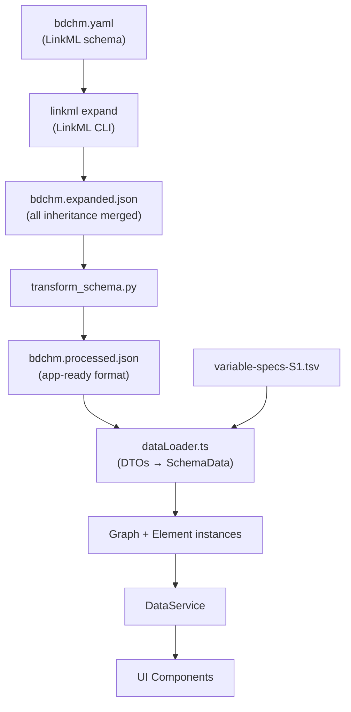

# Architecture

> Technical architecture and design decisions.
> For development rules, see [CLAUDE.md](../CLAUDE.md).
> For tasks and roadmap, see [TASKS.md](../TASKS.md).

---

## Tech Stack

- **Frontend**: React 18 + TypeScript + Vite
- **Styling**: Tailwind CSS
- **Testing**: Vitest + React Testing Library
- **Data**: LinkML schema (YAML) + TSV variable specifications
- **Graph**: [graphology](https://graphology.github.io/) library
- **Visualization**: Native SVG with gradient definitions
- **State Management**: React Hooks + URL parameters + localStorage

---

## Architecture Philosophy: Shneiderman's Mantra

**"Overview First, Zoom and Filter, Details on Demand"**

This principle guides the UX design:

**1. Overview First** — Show model topology with all relationship types visible:
- Class inheritance tree (hierarchical view)
- Class→Enum usage patterns (which classes use which value sets)
- Class→Class associations (domain relationships)
- Slot definitions shared across classes

**2. Zoom and Filter** (future enhancements):
- Full-text search across classes, variables, enums, slots
- Faceted filtering (class type, variable count, relationship type)
- k-hop neighborhood view (show only elements within N steps of focal element)
- Relationship type filters (show only `is_a` vs show associations)

**3. Details on Demand** — Progressive disclosure:
- Click to open detailed views
- Show class definitions, descriptions, attributes, slots
- Display variable specifications with data types and units
- Show inheritance chains with attribute overrides
- Bidirectional navigation between related elements

---

## Data Flow Overview

> **Note**: The Python transform step is planned to change — we intend to use
> LinkML's `SchemaView` / `induced_slot()` from Python `linkml-runtime` to
> correctly resolve per-class slot definitions. See [TASKS.md](../TASKS.md).

```mermaid
graph TD
    YAML["bdchm.yaml<br/>(LinkML schema)"]
    EXPAND["linkml expand<br/>(LinkML CLI)"]
    EXPANDED["bdchm.expanded.json<br/>(all inheritance merged)"]
    TRANSFORM["transform_schema.py"]
    PROCESSED["bdchm.processed.json<br/>(app-ready format)"]
    TSV["variable-specs-S1.tsv"]
    LOADER["dataLoader.ts<br/>(DTOs → SchemaData)"]
    GRAPH["Graph + Element instances"]
    SERVICE["DataService"]
    UI["UI Components"]

    YAML --> EXPAND --> EXPANDED --> TRANSFORM --> PROCESSED
    PROCESSED --> LOADER
    TSV --> LOADER
    LOADER --> GRAPH --> SERVICE --> UI
```

### Key files in the pipeline

| File | Role |
|------|------|
| `scripts/transform_schema.py` | Transforms expanded LinkML JSON into app-specific format |
| `src/input_types.ts` | TypeScript DTOs matching the processed JSON shape |
| `src/utils/dataLoader.ts` | Loads JSON/TSV, transforms DTOs → domain types (`SchemaData`) |
| `src/models/SchemaTypes.ts` | Domain types used after transformation (`SlotData`, `ClassData`, etc.) |
| `src/models/Element.ts` | Domain model classes (`ClassElement`, `SlotElement`, etc.) |
| `src/services/DataService.ts` | API layer between model and UI |
| `src/components/` | React components (must only use `Element` and `DataService`) |

---

## LinkML Concepts

### Slots, Attributes, and Slot Usage

LinkML has three mechanisms for associating properties with classes:

1. **Top-level slots** (`slots:` section) — Reusable, first-class property definitions. Multiple classes can reference the same slot.

2. **Inline attributes** (`attributes:` on a class) — Class-owned property definitions. From LinkML docs: *"Attributes are really just a convenient shorthand for being able to declare slots 'inline'."* Despite the syntactic sugar, LinkML internally treats same-named attributes on different classes as **distinct slots** (mangled as `class__slot`).

3. **Slot usage** (`slot_usage:` on a class) — Refinements of an existing slot for a specific class context. Adds constraints (narrower range, required, etc.) without creating a new slot.

### Induced Slots

The canonical way to get a slot's effective definition for a specific class is LinkML's **induced slot** concept (`SchemaView.induced_slot(slot_name, class_name)`). It merges all layers:

1. `slot_usage` and `attributes` on the target class
2. Mixin class contributions
3. Parent class (`is_a`) contributions, recursively
4. Top-level slot definition
5. Schema defaults

All LinkML generators (JSON Schema, Python, Pydantic) use `class_induced_slots()` to get per-class definitions.

### Conflicting Inline Attributes (fixed 2026-08-24)

`transform_schema.py` used to create one slot entry per unique name: when several classes declared the same attribute name differently, the **first class encountered won** — first being dict iteration order — and the rest were silently dropped behind a stderr warning. Two edges in the shipped diagram were wrong as a result (`items` and `part_of`).

`resolve_slot_ids()` now decides the id for every `(class, attribute)` site up front. **One rule: if two sites disagree on a load-bearing field, they are not the same slot**, so every site of that name gets its own `{slot}-{Class}` id and none keeps the bare name. A name whose sites all agree keeps its bare id.

Load-bearing means `range`, `multivalued`, `required` — and only those, with `None` normalized to `False`. Disagreement on `description` or `owner` is not a conflict. This is deliberate: a Dec 2025 attempt compared nearly every field, qualified ~109 of 260 slots, and was abandoned.

Of 46 attribute names declared on more than one class, **18 conflict**; 165 sites are qualified, giving 337 slot ids. The larger id set is internal — `SlotElement.displayName` renders the bare name, so qualified ids never reach the UI.

Two invariants this rests on, both easy to break:

- **`transform_classes` and `transform_slots` must consume the same decision.** They previously derived slot ids independently; disagreement leaves a class referencing an id with no entry in `slots`.
- **Global-slot metadata is keyed by NAME, not by the bare id** (which conflicting global slots no longer have). `global` and `slot_url` apply to every site; the canonical `range`/`required`/`multivalued` restore applies **only** to an unqualified entry, since writing it onto a qualified entry would overwrite the per-class definition that entry exists to record.

Using `induced_slot()` from `linkml-runtime` remains the more principled long-term route (see [TASKS.md](../TASKS.md)); the current approach reproduces the part of it this app needs without adding the dependency.

---

## Graph Architecture (Slots-as-Edges)

Graph model using graphology with slots serving dual roles.

**Nodes:**
- **Classes**: Entity, Specimen, Material, etc.
- **Enums**: SpecimenTypeEnum, AnalyteTypeEnum, etc.
- **Slots**: All slot definitions (337 in BDCHM; conflicting names are qualified per class), browsable in middle panel only
- **Types**: Primitives (string, integer) and custom types
- **Variables**: Appear in detail boxes and relationship hovers, not as panel sections

**Edges:**
- **Inheritance**: Class → Parent Class (is-a)
- **Slot**: Class → Range (Class | Enum | Type) through a slot
  - Properties: slotName, slotDefId, required, multivalued, inheritedFrom
  - Multiple edges can reference same SlotElement (e.g., inherited with overrides)
- **MapsTo**: Variable → Class associations

**Three-Panel Layout:**
- **Left Panel**: Classes (always visible tree hierarchy)
- **Middle Panel**: Slots (toggleable)
- **Right Panel**: Ranges (Classes, Enums, Types as range targets)

When middle panel is visible, Class→Range slot edges decompose into two visual links: Class→Slot→Range.

---

## Two apps: the Explore SPA (default) and the previous app

Since 2026-08-12 there are **two Vite entry points**:

- **`index.html` → `src/explore/`** — the Explore SPA, now the default app.
  Selection table + layered ownership DAG + detail drawer. See
  **[EXPLORE_VIZ.md](EXPLORE_VIZ.md)**. State (`?sel=`, `?exp=`, `?detail=`,
  `?roots=`) is URL-encoded through a single writer in `ExploreApp.tsx`.
- **`previous.html` → `src/App.tsx`** — the previous app, holding the three
  older views below, linked each way from the header.

`src/explore/graph-core/` is the layout/zoom engine (ELK in a worker, pan/zoom,
edge paths) with **zero app imports** — the intended package-extraction
boundary. Do not import DataService or app state into it.

### The previous app's three views

Three top-level views (header toggle; `?view=` URL param), all mounted, shown via
CSS in `App.tsx`:
- **Explorer** (default) — progressive-disclosure entity browser (`EntityExplorer`).
- **Kitchen Sink** — the three-panel layout (`LayoutManager`) described above.
- **Focus** — selection-driven subset view (`FocusView`). See **[FOCUS_VIEW.md](FOCUS_VIEW.md)**.

**Focus reuses Kitchen Sink primitives, not its layout.** It is a separate
component (`FocusView`) that composes `ItemsPanel`/`Section`/`LinkOverlay` and the
floating-box system — NOT a mode of `LayoutManager` (whose layout is hardcoded to
the 3-panel shape). The shared floating-box orchestration is being extracted into a
`useFloatingBoxes` hook consumed by both.

**Ownership graph** (called "containment" in code; the rename is pending).
`DataService.getContainmentGraph(classIds?)` derives a directed (possibly
cyclic) graph live from the schema graph via the FK-inversion heuristic in
`src/models/containmentGraph.ts` (TS port of
`scripts/extract_containment_tree.py`). `getContainmentNodes()` adapts it to the
`dag-browser-widget` `Node[]` shape. This replaces the static
`public/*-graph.json` mockup data (which had drifted from the schema).

**The heuristic's default is a guess, and it misfires.** Single-valued slot to
an entity range ⇒ `own-flip` ("the target owns the source"), which is right for
real FKs and wrong for identity-less value objects. `Activity` was misclassified
exactly this way and had to be adjudicated onto `VALUE_OBJECTS` (2026-08-19).
Expect to re-check `VALUE_OBJECTS` and `OWNERSHIP_OVERRIDES` after every
upstream schema sync — see [OWNERSHIP_CLASSIFICATION.md](OWNERSHIP_CLASSIFICATION.md).

**`DataService.getOwnershipSubgraph(selected, expansions, options)`**
(`src/models/ownershipSubgraph.ts`) is what the Explore canvas draws: the
selection, edges among them, and each node's **direct owners** (one hop, capped
at `ownerCap`, default 8). Owners over the cap are returned in `hiddenOwners`
for chip rendering instead. `pathToRoot: true` restores transitive
ancestors-to-root, which is off by default because it is a reverse-reachability
closure — see EXPLORE_VIZ.md §6 for the measurements.

---

## Architecture Patterns

**Element-Based Architecture**:
- Base `Element` class with subclasses: `ClassElement`, `EnumElement`, `SlotElement`, `VariableElement`
- Each element knows its name, type, and relationships
- `ElementRegistry` centralizes type metadata (colors, labels, icons)

**Collection Pattern**:
- Each element type has a corresponding collection class
- Collections stored in `Map<ElementTypeId, ElementCollection>`
- Generic interfaces enable type-safe iteration

**Generic Tree Types**:
- `Tree<T>` and `TreeNode<T>` for hierarchical data
- Reusable for class hierarchies and variable groupings
- Generic operations: `flatten()`, `find()`, `getLevel()`, `map()`

**RenderableItem Interface**:
- Separates data structure from presentation
- Collections provide `getRenderableItems()` returning structure metadata
- UI components render generically without type-specific logic

---

## DTOs vs Domain Models vs DataService

> **Note**: This layering is likely to simplify as we integrate `linkml-runtime`.
> See [TASKS.md](../TASKS.md).

**Current layers:**
- **DTOs** (`input_types.ts`): Raw data shapes matching JSON/TSV files
- **Domain types** (`models/SchemaTypes.ts`): Transformed types (`SlotData`, `ClassData`, etc.)
- **Domain models** (`models/Element.ts`): Classes with behavior (`ClassElement`, `SlotElement`, etc.)
- **DataService** (`services/DataService.ts`): API layer between models and UI

**Flow**: DTOs → dataLoader transforms → domain types → Element instances → DataService → UI

**Completed refactoring:**
- `types.ts` → `input_types.ts` (clarify as DTOs)
- UI types (`ItemInfo`, `EdgeInfo`, `DetailSection`) → `ComponentData.ts`
- `import_types.ts` imported only by dataLoader, Element, SchemaTypes, and tests

### Element Identity: .displayName vs .name / getId()

Use `.displayName` for anything the user reads, `.name`/`getId()` for identity.

| Method | Use for |
|--------|---------|
| `.displayName` | Display (titles, labels, table cells, sorting) |
| `.name` | Identity: map keys, lookups, joins against graph node ids |
| `getId()` | Identity comparisons, relationship data structures |
| `getId(context)` | DOM IDs needing panel-specific uniqueness |

**`.name` is NOT the display name.** For most elements the two are equal, so the
distinction is invisible until it isn't. `SlotElement` is the exception: where a
slot name has per-class definitions the transform qualifies its id, so `.name`
is `observations-ObservationSet` while `.displayName` is `observations`.

`displayName` is a getter on the base `Element` returning `this.name`, overridden
in `SlotElement`. Sorting a user-visible list belongs in the display column —
sorting slots by `.name` files `value-QuestionnaireResponseValueBoolean` under
its class suffix instead of beside the other `value` slots.

Rendering `.name` for a slot is the bug that shipped from Dec 2025 to Aug 2026
(qualified ids on screen). `src/test/slotDisplayName.test.ts` guards it by
asserting the attributes-table Name column equals the graph's edge label.

### Attributes as data: `getAttributeSummaries()`

`getDetailData()` renders a class's attributes as a **table**, with
required/multivalued printed as `'Yes'`/`'No'`. Anything that needs to *reason*
about attributes — cardinality labels, for instance — must not parse that back
out. `Element.getAttributeSummaries()` returns the same slots in the same
declared order as `{name, range, description, required, multivalued}`, with
`name` already the bare display name.

It is a polymorphic method on the base `Element` returning `[]`, overridden in
`ClassElement`, rather than an `instanceof ClassElement` narrowing in
DataService — see the enforcement rules in [CLAUDE.md](CLAUDE.md).
`getClassSummary` consumes it, which is why every attribute row in the
ownership view can show a cardinality whether or not it is drawn as an edge.
