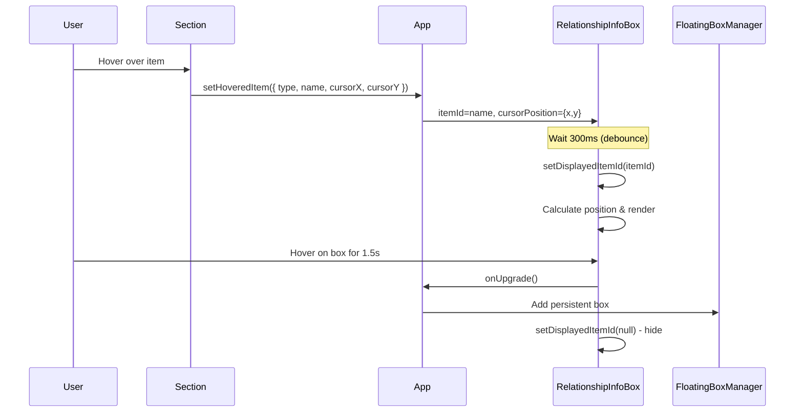
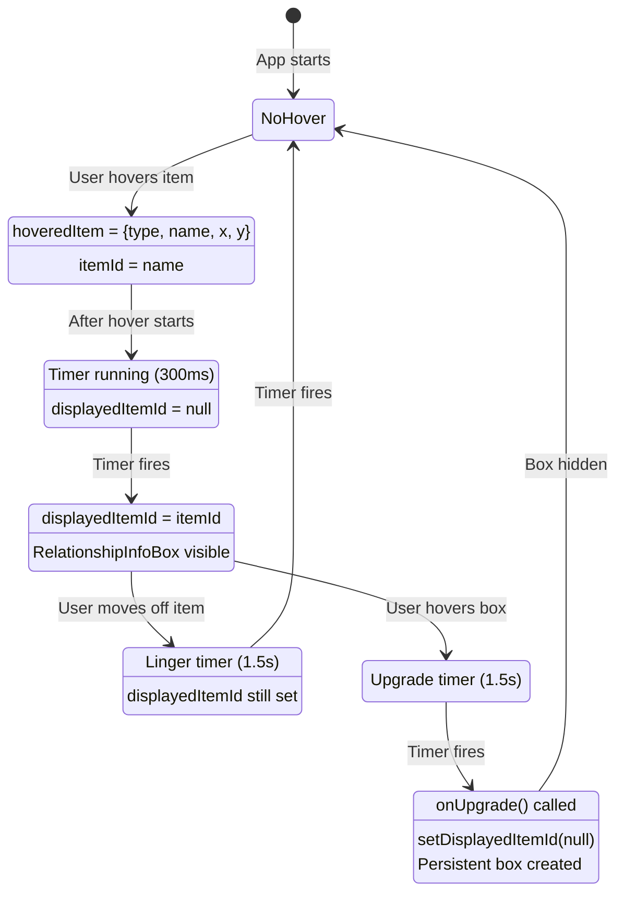

# Component Flow Documentation

## RelationshipInfoBox & FloatingBoxManager Interaction

This document explains how hover interactions work and how boxes are managed.

## High-Level Flow



## State Flow Diagram



## Component Architecture

### RelationshipInfoBox

**Purpose**: Shows relationship information on hover (transitory display)

**Key State**:
- `displayedItemId`: Which item's info to show (null = hidden)
- `boxPosition`: Where to render the box { x, y }
- `expandedSections`: Which sections are expanded

**Key Props from App**:
- `itemId`: The hovered item name (from hoveredItem?.name)
- `cursorPosition`: Mouse position { x, y } (from hoveredItem)
- `onUpgrade()`: Callback to convert to persistent box

**Timers**:
1. `hoverTimerRef` (300ms): Debounce before showing box
2. `lingerTimerRef` (1500ms): How long to keep showing after mouse leaves
3. `upgradeTimerRef` (1500ms): How long to hover on box before upgrading

**Effect Logic** (lines 55-124):
```
When itemId or displayedItemId changes:
  1. Clear all timers
  2. If itemId exists:
     - Start hoverTimer (300ms)
     - When fires: setDisplayedItemId(itemId) & calculate position
  3. Else if displayedItemId exists:
     - Start lingerTimer (1500ms)
     - When fires: setDisplayedItemId(null)
```

**Current Issue**: The effect doesn't re-run when cursorPosition changes (we removed it from deps), but the timer callback captures the cursorPosition value at effect creation time. If cursorPosition is null initially, it stays null.

### FloatingBoxManager

**Purpose**: Manages floating and stacked boxes

**Two Modes**:

1. **Stacked Mode** (lines 78-99):
   - Vertical column of boxes
   - Fixed width (600px - TOO RIGID)
   - No dragging/resizing
   - Has close buttons

2. **Dialog Mode** (lines 102+):
   - Floating draggable boxes
   - Cascade positioning
   - Resizable
   - Z-index based on array position

**FloatingBox Component** (lines 135-404):
- Handles drag, resize, positioning
- Different rendering for stacked vs dialog
- Cascade offset: 40px
- Default size: 900x350

## Data Flow: Hover to InfoBox

```
User hovers "Specimen" in left panel
  ↓
getItemHoverHandlers creates handlers with:
  - type: 'class'
  - name: 'Specimen'
  - onItemHover: setHoveredItem
  ↓
onMouseEnter fires → setHoveredItem({
  type: 'class',
  name: 'Specimen',
  cursorX: 450,
  cursorY: 300
})
  ↓
App.tsx hoveredItem state updates
  ↓
App.tsx computes: hoveredItemId = hoveredItem?.name → "Specimen"
  ↓
RelationshipInfoBox receives:
  - itemId="Specimen" (changes from null → "Specimen")
  - cursorPosition={x: 450, y: 300} (changes from null)
  ↓
Effect runs (deps: [itemId, displayedItemId])
  - itemId exists → start hoverTimer
  - After 300ms → setDisplayedItemId("Specimen")
  - Calculate position using cursorPositionRef.current
  ↓
displayedItemId = "Specimen" → box renders
```

## Architectural Corrections

### Terminology

- **displayMode**: Should be `'cascade'` (not 'dialog') and `'stacked'`
  - 'cascade': Floating boxes with cascading initial position
  - 'stacked': Boxes in vertical column (fixed width panel)
  - Affects: Initial position, repositioning on mode change

### Box Modes (NOT display modes)

- **Transitory boxes**: Hover-triggered, auto-hide, can upgrade to persistent
  - Example: RelationshipInfoBox
  - ARE floating boxes (have FloatingBox wrapper)
  - Upgrade = change mode to persistent + move to end of persistent array
  - Should NOT create new box on upgrade

- **Persistent boxes**: User-opened, stay until explicitly closed
  - Have full chrome (drag, resize, close button)
  - Close with ESC (oldest first, after transitory boxes)

### Issue 1: Hover positioning (CORRECTED)

**Wrong approach**: Use cursor position for transitory box placement
- Cursor position constantly updates on mouse move
- Unnecessary dependency in effect
- Causes non-deterministic behavior

**Correct approach**: Use DOM position of hovered item
- Get bounding rect of item element
- Position box relative to item (e.g., to the right)
- Stable, deterministic positioning
- No need to track cursor at all for initial display

### Issue 2: Viewport bounds (CORRECTED)

**Original understanding was WRONG**

**Correct behavior**:
- Initial position: Apply bounds checking (don't let NEW boxes overflow)
- User-positioned: Allow overflow (user dragged it there, respect their choice)
- After drag/resize: Keep user's position (even if off-screen)

**Current implementation** (lines 148-190):
- Multi-stack cascade algorithm
- Automatically wraps to new stack when vertical space exhausted
- Each stack offset leaves 1/3 of previous box visible
- Uses cartesian coordinates (origin at bottom) for calculations
- Converts to browser coordinates for rendering

**No need to clamp user-positioned boxes** - that was the wrong fix

### Issue 3: Stacked width too rigid

**Current**: `w-[600px] flex-shrink-0` (line 83)

**Should be**: Calculate based on available space after panels

## Major Architecture Refactoring Needed

### 1. Fix transitory/persistent box architecture

**Current (WRONG)**:
- handleUpgradeRelationshipBox creates NEW box
- Uses cursor position for new box position
- Two separate boxes (transitory disappears, new one appears)

**Correct**:
- Upgrade should change existing box mode from 'transitory' to 'persistent'
- Box stays in same position (no jump)
- Move box from transitory array to end of persistent array (for ESC ordering)
- OR: Keep single array, ESC logic checks mode

### 2. Remove isStacked property from FloatingBox

**Current**: `isStacked` prop determines rendering
**Problem**: Comment says "non-draggable, fixed in panel" but ALL persistent boxes should be draggable

**Correct**:
- `displayMode` determines initial position and repositioning on mode change
- All boxes have same features: drag, resize, close with ESC
- Remove `isStacked` prop entirely

### 3. Fix hover to use item position, not cursor

**Current**: Tracks cursor position, passes to RelationshipInfoBox
**Problems**:
- Effect re-runs on cursor move (or tries to avoid this with refs)
- Non-deterministic behavior
- Unnecessary complexity

**Correct**:
- Pass item DOM element ID or ref
- RelationshipInfoBox queries DOM for bounding rect
- Position box relative to item (e.g., `itemRect.right + 20px`)
- Stable, deterministic

### 4. Move box management to FloatingBoxManager

**Current**: App.tsx handles:
- Box array management
- Duplicate detection
- Bring-to-front logic
- Upgrade logic

**Should be**: FloatingBoxManager handles all box lifecycle
- App.tsx: Minimal state, just pass data
- FloatingBoxManager: All array manipulation
- Cleaner separation of concerns

### 5. Fix stacked width calculation

**Current**: Fixed 600px
**Correct**: `calc(100vw - leftPanelWidth - rightPanelWidth - margins)`

## Implementation Priority

1. **Fix hover (critical)** - Use item position, remove cursor tracking
2. **Fix upgrade (critical)** - Modify existing box, don't create new
3. **Remove isStacked** - Simplify rendering logic
4. **Fix stacked width** - Make responsive
5. **Refactor to FloatingBoxManager** - Bigger refactor, do last

## Next Steps

Remove debug logging and implement fixes in priority order?
