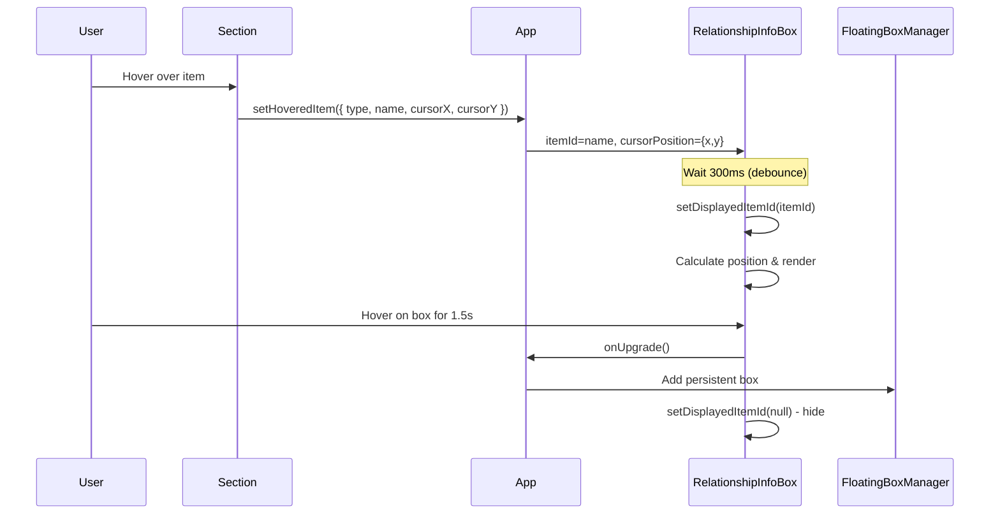
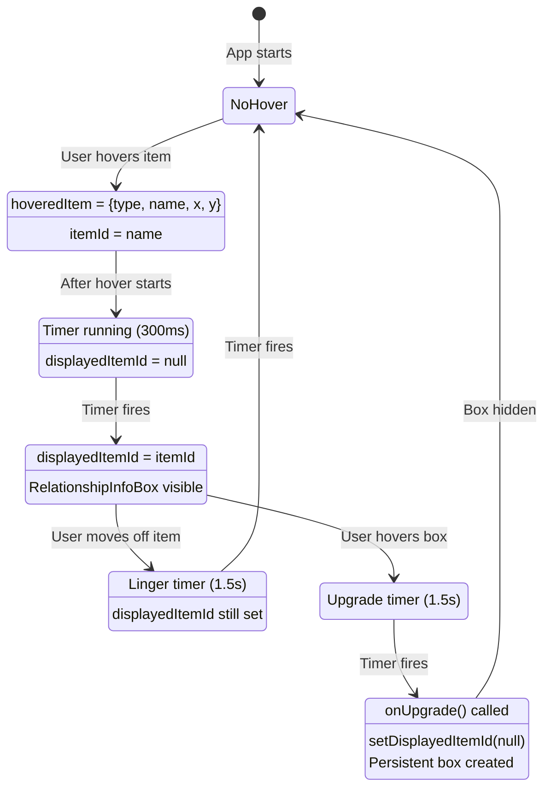

# Component Flow Documentation

## RelationshipInfoBox & FloatingBoxManager Interaction

This document explains how hover interactions work and how boxes are managed.

## High-Level Flow



## State Flow Diagram



## Component Architecture

### RelationshipInfoBox

**Purpose**: Shows relationship information on hover (transitory display)

**Key State**:
- `displayedItemId`: Which item's info to show (null = hidden)
- `boxPosition`: Where to render the box { x, y }
- `expandedSections`: Which sections are expanded

**Key Props from App**:
- `itemId`: The hovered item name (from hoveredItem?.name)
- `cursorPosition`: Mouse position { x, y } (from hoveredItem)
- `onUpgrade()`: Callback to convert to persistent box

**Timers**:
1. `hoverTimerRef` (300ms): Debounce before showing box
2. `lingerTimerRef` (1500ms): How long to keep showing after mouse leaves
3. `upgradeTimerRef` (1500ms): How long to hover on box before upgrading

**Effect Logic** (lines 55-124):
```
When itemId or displayedItemId changes:
  1. Clear all timers
  2. If itemId exists:
     - Start hoverTimer (300ms)
     - When fires: setDisplayedItemId(itemId) & calculate position
  3. Else if displayedItemId exists:
     - Start lingerTimer (1500ms)
     - When fires: setDisplayedItemId(null)
```

**Current Issue**: The effect doesn't re-run when cursorPosition changes (we removed it from deps), but the timer callback captures the cursorPosition value at effect creation time. If cursorPosition is null initially, it stays null.

### FloatingBoxManager

**Purpose**: Manages floating and stacked boxes

**Two Modes**:

1. **Stacked Mode** (lines 78-99):
   - Vertical column of boxes
   - Fixed width (600px - TOO RIGID)
   - No dragging/resizing
   - Has close buttons

2. **Dialog Mode** (lines 102+):
   - Floating draggable boxes
   - Cascade positioning
   - Resizable
   - Z-index based on array position

**FloatingBox Component** (lines 135-404):
- Handles drag, resize, positioning
- Different rendering for stacked vs dialog
- Cascade offset: 40px
- Default size: 900x350

## Data Flow: Hover to InfoBox

```
User hovers "Specimen" in left panel
  ↓
getItemHoverHandlers creates handlers with:
  - type: 'class'
  - name: 'Specimen'
  - onItemHover: setHoveredItem
  ↓
onMouseEnter fires → setHoveredItem({
  type: 'class',
  name: 'Specimen',
  cursorX: 450,
  cursorY: 300
})
  ↓
App.tsx hoveredItem state updates
  ↓
App.tsx computes: hoveredItemId = hoveredItem?.name → "Specimen"
  ↓
RelationshipInfoBox receives:
  - itemId="Specimen" (changes from null → "Specimen")
  - cursorPosition={x: 450, y: 300} (changes from null)
  ↓
Effect runs (deps: [itemId, displayedItemId])
  - itemId exists → start hoverTimer
  - After 300ms → setDisplayedItemId("Specimen")
  - Calculate position using cursorPositionRef.current
  ↓
displayedItemId = "Specimen" → box renders
```

## Problem Analysis

### Issue 1: Hover not working initially

**Hypothesis**: cursorPositionRef initialization

```typescript
const cursorPositionRef = useRef(cursorPosition);  // Line 47
```

On first render:
- `cursorPosition` prop is `null` (no hover yet)
- `cursorPositionRef.current` is initialized to `null`
- Effect on line 50-52 updates ref when cursorPosition changes
- BUT: If user hovers before ref updates, timer callback sees null

**Test**: Does cursorPositionRef.current have a value when timer fires?

### Issue 2: Viewport bounds not working

**Current code** (lines 151-159):
```typescript
const cascadeX = 100 + (index * CASCADE_OFFSET);
const cascadeY = window.innerHeight - 400 + (index * CASCADE_OFFSET);
const maxX = window.innerWidth - defaultSize.width - 20;
const maxY = window.innerHeight - defaultSize.height - 20;
const defaultPosition = {
  x: Math.min(cascadeX, maxX),
  y: Math.min(cascadeY, maxY)
};
```

**Problem**: This only constrains the INITIAL position. Once `box.position` is set (e.g., from URL restoration or after dragging), line 161 uses that:

```typescript
const [position, setPosition] = useState(box.position ?? defaultPosition);
```

If `box.position` exists, bounds checking is bypassed!

### Issue 3: Stacked width too rigid

**Current**: `w-[600px] flex-shrink-0` (line 83)

**Should be**: Calculate based on available space after panels

## Fixes Needed

### Fix 1: Hover - Ensure cursorPosition is available

Option A: Always use latest cursorPosition in callback (keep ref approach)
Option B: Revert to including cursorPosition in deps but prevent timer reset
Option C: Store cursor position separately, don't tie to hover state

### Fix 2: Viewport bounds - Apply to all positions

Need to clamp position on:
1. Initial render (✓ done)
2. After drag ends
3. After resize
4. After mode switch

### Fix 3: Stacked width - Dynamic calculation

Calculate: `window.innerWidth - leftPanelWidth - rightPanelWidth - margins`

## Recommended Approach

1. **Add debug logging** to understand actual state flow
2. **Test hypothesis** about cursorPositionRef timing
3. **Fix hover** based on findings
4. **Add position clamping** utility function used everywhere
5. **Make stacked width** responsive to panel sizes

Would you like me to:
A) Add debug logging first to verify hypothesis?
B) Try the fixes based on current understanding?
C) Create an interactive walkthrough with console.log statements?
