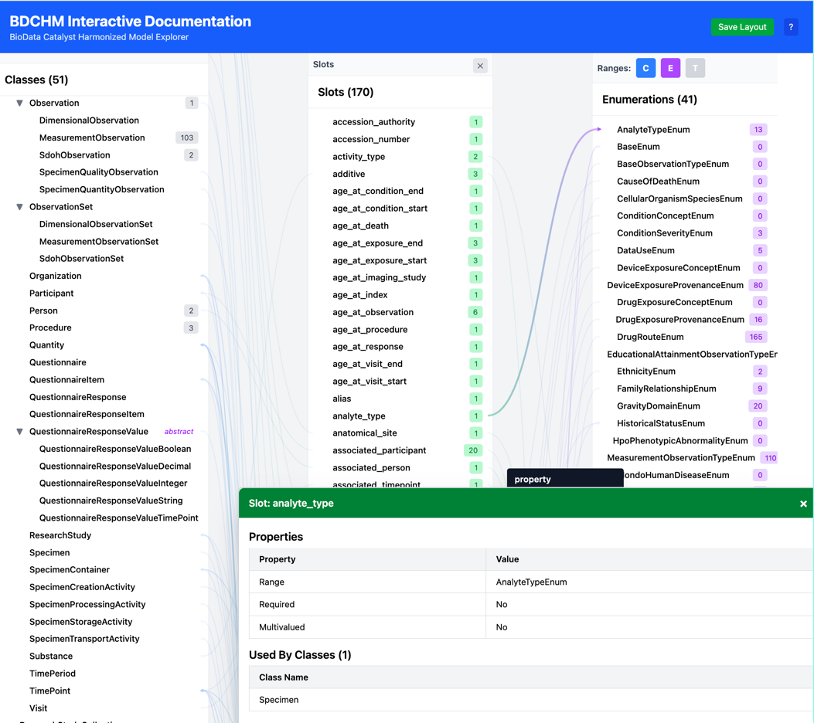

# Tasks

## Questions & Decisions Needed

### Different Variable Treatment for Condition and Drug Exposure Classes 

> **Anne**: I think I made a mistake by calling "asthma" and "angina" variables. BMI is a variable that is a Measurement observation. We can think of BMI as a column in a spreadsheet. We wouldn't have a column for "asthma" - we would have a column for conditions with a list of mondo codes for the conditions present. This becomes more important when we are talking about the "heart failure" and "heart disease" columns. Where does one draw lines? The division of conditions into variables/columns might be ok if all we're looking at is asthma and angina, but quickly gets too hard to draw lines.

> **Siggie**: So, should those variables appear in the variable specs at all? If so, how should we represent them? And are there other variables in the specs that need special treatment or don't belong?

> **Anne**: I think they should appear, just differently. Perhaps as a list? maybe a layered donut? I think DrugExposures will need to be depicted in the same way

> **Siggie**:
    what should i call these things if not variables?
    layered donut? sounds tasty, but i'm not sure how it would work.
    do we have additional documentation for any of these that we would want to include? like we could set up Angina to link to angina_prior_1 if that would be appropriate

> **Anne**:
    You can call them Conditions and Drug Exposures for now
    I think for angina, we would want a link to the URI

> **Siggie**:
    where would i get the URI?

> **Anne**:  

> **Siggie**:  

---

## Next Up (Ordered)

### Restore Data Interface Contracts (Phase 11) ✅ COMPLETED

**Goal**: Fix architectural violations in App.tsx - restore proper contract-based separation where components define data needs, DataService provides data, and model layer adapts.

**Problem**: App.tsx is directly accessing `modelData.collections` and importing from models layer, violating the contract pattern established in Phase 6.5.

**Current violations**:
1. Imports `ELEMENT_TYPES`, `getAllElementTypeIds`, `ElementTypeId` from models/ElementRegistry
2. Directly calls `collection.getSectionData()` instead of using DataService
3. Exposes model structure to view layer

**Expected pattern** (from Phase 6.5):
- Component defines data contract (e.g., `SectionData` interface in Section.tsx)
- DataService provides method returning that data (e.g., `getAllSectionsData(position)`)
- DataService internally accesses model layer (collections, Element instances)
- App.tsx never imports from models/ or accesses collections directly

**Implementation steps**:

0. **Audit and revert violations** ✅ COMPLETED
   - ✅ Checked commits from Phase 6.5 through current
   - ✅ Verified Phase 6.5 contract pattern was correct (components define, collections provide)
   - ✅ Identified that Phase 11 Step 0 (DataService) was incomplete, not wrong

   **Audit findings**:
   - Phase 6.5 correctly established contracts (SectionData, SectionItemData, ToggleButtonData)
   - Phase 11 Step 0 created DataService for components (DetailContent, RelationshipInfoBox) ✅
   - BUT left App.tsx with direct model access (incomplete work, not architectural violation)
   - **No reversion needed** - just need to complete the DataService abstraction

   **Current violations in App.tsx**:
   - Line 10: Imports from models/ElementRegistry
   - Lines 244-260: Calls `collection.getSectionData()` directly
   - Lines 55-75: Accesses `ELEMENT_TYPES` directly for toggle buttons

   **Conclusion**: Architecture is sound, just finish what Step 0 started

1. **Add DataService methods for section data** ✅ COMPLETED
   - ✅ Added `getAllSectionsData(position: 'left' | 'right'): Map<string, SectionData>`
   - ✅ Returns Map<string, SectionData> where key is section ID ('class', 'enum', etc.)
   - ✅ Internally calls `collection.getSectionData(position)` for each collection

2. **Add DataService methods for toggle buttons** ✅ COMPLETED
   - ✅ Added `getToggleButtonsData(): ToggleButtonData[]`
   - ✅ Returns array of toggle button metadata
   - ✅ Internally accesses ELEMENT_TYPES registry

3. **Add DataService helper methods** ✅ COMPLETED
   - ✅ `getAvailableItemTypes()` already exists (equivalent to getAllItemTypeIds)
   - ✅ All necessary metadata methods now available

4. **Update App.tsx** ✅ COMPLETED
   - ✅ Removed imports from models/ElementRegistry
   - ✅ Replaced `modelData.collections.forEach(...)` with `dataService.getAllSectionsData()`
   - ✅ Using DataService for all model access
   - ✅ No direct collection access remains

5. **Update check-architecture.sh** ✅ COMPLETED
   - ✅ Added check for App.tsx in Check 3 (model layer imports)
   - ✅ App.tsx now included in architecture validation

6. **Verify contracts end-to-end** ✅ COMPLETED
   - ✅ Component defines interface (SectionData, ToggleButtonData)
   - ✅ DataService provides data matching interface
   - ✅ Model layer adapts via methods
   - ✅ No component (including App.tsx) imports from models/

**Files modified**:
- ✅ src/services/DataService.ts - Added getAllSectionsData(), getToggleButtonsData()
- ✅ src/App.tsx - Removed model imports, now uses DataService
- ✅ scripts/check-architecture.sh - Extended checks to App.tsx

**Success criteria** (all met):
- ✅ App.tsx has zero imports from models/
- ✅ App.tsx never accesses modelData.collections directly
- ✅ npm run check-arch passes
- ✅ npm run typecheck passes
- ✅ All contracts flow: Component → DataService → Model

---

### Unified Detail Box System (Phase 12)

**Goal**: Extract dialog management from App.tsx, merge DetailDialog/DetailPanelStack into unified system, and implement transitory mode for FloatingBox - allowing any content to appear temporarily (auto-disappearing) and upgrade to persistent mode on user interaction.

**Current state**:
- DetailPanel: 130-line content renderer using getDetailData() ✅
- RelationshipInfoBox: Hover preview with relationships, has its own drag/close logic
- DetailDialog: Floating draggable/resizable wrapper
- DetailPanelStack: Stacked non-draggable wrapper
- App.tsx: Manages openDialogs array and mode switching

**New file structure**:
```
src/components/
  DetailContent.tsx         (rename from DetailPanel.tsx - content renderer, uses getDetailData())
  RelationshipInfoBox.tsx   (keep - relationship content renderer)
  FloatingBoxManager.tsx    (new - manages array + rendering)
    - FloatingBox component (draggable/resizable wrapper)
    - Array management (FIFO stack)
    - Mode-aware positioning
```

**Key insight**: FloatingBox is a general-purpose wrapper that supports two display modes (transitory and persistent) for any content type

**FloatingBox Modes**:

1. **Transitory mode** (temporary, auto-disappearing):
   - Appears on trigger (hover, click, etc.)
   - Auto-disappears after timeout or when user moves away
   - Minimal chrome (no close button, simpler appearance)
   - Can be "upgraded" to persistent mode via user interaction
   - Example: RelationshipInfoBox on hover

2. **Persistent mode** (permanent until closed):
   - Stays open until explicitly closed (ESC or close button)
   - Full chrome (draggable, resizable, close button)
   - Added to FloatingBoxManager's array
   - Managed via URL state for restoration
   - Example: Clicking element name to view details

**FloatingBox component** (single component, supports both modes):
- **Content agnostic**: Renders any React component passed as content
- **Display metadata pattern** (maintains view/model separation):
  ```typescript
  interface FloatingBoxProps {
    mode: 'transitory' | 'persistent';
    metadata: {
      title: string;        // e.g., "Specimen" or "Relationships: Specimen"
      color: string;        // e.g., "blue" (from app config)
    };
    content: React.ReactNode;  // <DetailContent element={...}/> or <RelationshipInfoBox element={...}/>
    onClose?: () => void;
    onUpgrade?: () => void;  // Transitory → persistent upgrade
  }
  ```
- **Data flow** (no element types in FloatingBox):
  1. Caller (App/FloatingBoxManager) has Element reference
  2. Caller calls `element.getFloatingBoxMetadata()` → returns `{ title, color }`
  3. Caller passes metadata + content component to FloatingBox
  4. FloatingBox only sees plain data, never Element type
- Mode determines chrome and behavior:
  - Transitory: Minimal styling, no close button, auto-dismiss timers
  - Persistent: Full controls, draggable, resizable, click-to-front
- ESC closes first/oldest persistent box (index 0)

**Content types**:
1. **Detail content**: Full element details (slots table, variables, description, etc.)
2. **Relationship content**: Focused relationship view (inheritance, slots, incoming/outgoing)

**User can have multiple boxes open simultaneously**:
- Multiple detail boxes (compare elements side-by-side)
- Multiple relationship boxes (compare relationships)
- Mix of both types

**Positioning issues to fix** (deferred from Phase 10):
- **Vertical positioning**: Current logic can position boxes oddly (see Phase 10 screenshot)
- **Right edge overflow**: Box can extend past right edge of window
- Fix both when implementing FloatingBox positioning logic
- Ensure boxes stay fully within viewport bounds (auto-positioning only; allow user to drag outside)

**Transitory → Persistent Mode Upgrade Flow**:

**Example: Hover-triggered RelationshipInfoBox** (current Phase 10 implementation):

1. **Transitory mode trigger**:
    - Hover element → FloatingBox appears in transitory mode after 300ms
    - Content: RelationshipInfoBox (shows relationships)
    - No close button, minimal styling
    - Lingers 1.5s after unhover (unless interacted with)
    - **TODO**: Move timing constants to app config file (see "App Configuration File" task)

2. **Upgrade to persistent mode** (one of):
    - Hover over box for 1.5s
    - Click anywhere in box
    - Press hotkey (TBD)

3. **Persistent mode result**:
    - Same content, now in persistent FloatingBox
    - Gains full chrome (draggable, resizable, close button)
    - Added to FloatingBoxManager's array
    - Stays open until explicitly closed (ESC or close button)
    - Can open multiple boxes this way (compare relationships side-by-side)

**Other ways to open persistent FloatingBox**:

- **Click element name** (anywhere in UI):
  - Tree panel → opens DetailContent in persistent FloatingBox
  - RelationshipInfoBox → opens DetailContent in persistent FloatingBox
  - Opens directly in persistent mode (no transitory phase)
  - Multiple boxes can coexist: relationship view + detail view of linked element

**Transitory mode content choice**:

When hovering over an element, what content should appear in the transitory FloatingBox?
- Option A: RelationshipInfoBox (focused view of relationships)
- Option B: DetailContent (full element details)
- Option C: Help content (when implemented - context-sensitive help based on what's being hovered)

**Preferred approach: Position-based heuristic**

Hover behavior depends on where cursor is positioned:
- **Hover element name** → show DetailContent (full details preview)
- **Hover panel edge/between elements** → show RelationshipInfoBox (relationship preview)
- **Hover SVG link line** → show RelationshipInfoBox (relationship preview for that specific link)

**Rationale**:
- Contextual and intuitive - cursor position indicates intent
- No additional UI complexity
- No keyboard requirement
- Can be refined based on user feedback after implementation

**Implementation notes**:
- **Spacing between hover areas**: Ensure clear separation between name hover area and edge hover area
  - May need to make the inside end of element names non-hoverable
  - This helps users understand which hover target they're activating
- May need to tune hover target areas for discoverability
- Could add subtle visual cues (e.g., cursor changes, highlight areas)
- Keep simpler options as fallback if heuristic proves confusing

**Alternative approaches considered** (for reference):
- User preference toggle: Clear but adds UI complexity
- Keyboard modifier: Flexible but requires keyboard
- Time-based cascade: Progressive but potentially confusing
- Combination: Most flexible but overly complex for initial implementation

**Mode behavior** (intelligent repositioning):
- **Floating mode** (narrow screen): New boxes cascade from bottom-left
- **Stacked mode** (wide screen): New boxes open in stack area
    - Consider changing layout to newest on bottom, then new boxes can overlap so only header of previous shows
    - With click-to-front, this should work well
- **Mode switch to stacked**: All boxes move to stack positions
- **Mode switch to floating**:
    - User-repositioned boxes → restore custom position from URL state
    - Default boxes → cascade from bottom-left

**URL state tracking**:
- Track which boxes have custom positions (user dragged/resized)
- On mode switch, respect user customizations
- Default positions don't persist

**Important**:
- Make sure new boxes are always fully visible:
    - In stacked layout by scrolling
    - In floating, by resetting vertical cascade position when necessary

**Implementation steps**:

0. **✅ Create DataService abstraction layer** (COMPLETED)
    - **Goal**: Complete view/model separation - UI components should never see Element instances or know about element types
    - **Problem**: Currently UI code receives Element instances and calls methods directly, violating separation of concerns
    - **Solution**: Create DataService class that UI calls with item IDs (strings)

    **Architecture**:
    ```typescript
    // src/services/DataService.ts
    class DataService {
      constructor(private modelData: ModelData) {}

      // UI calls by ID, service handles Element lookup internally
      getDetailContent(itemId: string): DetailData | null
      getFloatingBoxMetadata(itemId: string): FloatingBoxMetadata | null
      getRelationships(itemId: string): RelationshipData | null
      // ... other data access methods
    }

    // App.tsx creates service
    const dataService = useMemo(() =>
      modelData ? new DataService(modelData) : null,
      [modelData]
    );

    // UI components only work with IDs and DataService
    <DetailContent itemId="Specimen" dataService={dataService} />
    <FloatingBoxManager boxes={boxes} dataService={dataService} ... />

    // DetailContent.tsx - no Element instances
    function DetailContent({ itemId, dataService }: Props) {
      const detailData = dataService.getDetailContent(itemId);
      if (!detailData) return <div>Item not found</div>;
      // Render using plain detailData object
    }
    ```

    **Benefits**:
    - UI never sees Element instances or element types
    - Clean boundary between model and view
    - Easy to mock DataService for testing
    - Terminology: Use "item" in UI code, "element" stays in model layer

    **Enforcement via automated checking**:
    - Create `scripts/check-architecture.sh` to grep for violations:
      ```bash
      #!/bin/bash
      # Check for "Element" or "elementType" in UI components (but not in tests)
      echo "Checking for Element references in UI code..."
      rg -t tsx -t ts "Element" src/components/ src/hooks/ --glob '!*.test.*' --glob '!*.spec.*'
      # Add more checks as needed
      ```
    - Add to workflow: **After every chunk of work, run `npm run check-arch` and report violations**
    - Add npm script: `"check-arch": "bash scripts/check-architecture.sh"`
    - Over time, enhance script to check other architectural principles from CLAUDE.md

    **Implementation sub-steps**:
    - ✅ Create DataService class with initial methods
    - ✅ Refactor App.tsx to use DataService
    - ✅ Refactor FloatingBoxManager to accept dataService + item IDs
    - ✅ Refactor DetailContent to accept itemId + dataService
    - ✅ Refactor RelationshipInfoBox to accept itemId + dataService
    - ✅ Deleted old components (DetailDialog, DetailPanelStack, useDialogState)
    - ✅ Create check-architecture.sh script
    - ✅ Add npm script `"check-arch": "bash scripts/check-architecture.sh"`
    - ✅ All architecture violations fixed
    - ⏭️  Update tests to use DataService pattern (deferred)

    **Status**: Main refactoring complete! All architecture checks passing.

0a. **Fix remaining architecture violations** ✅ COMPLETED
    - All architecture checks now pass (`npm run check-arch`)
    - No violations found in components, hooks, or App.tsx

1. **✅ Create FloatingBoxManager.tsx** (COMPLETED)
    - ✅ Extract openDialogs array management from App.tsx
    - ✅ Single FloatingBox component (merge DetailDialog drag/resize logic)
    - ✅ **Content agnostic**: Supports any React component (DetailContent, RelationshipInfoBox, future help content, etc.)
    - ✅ Mode-aware initial positioning
    - ✅ Click/drag/resize → bring to front (move to end of array)
    - ✅ **ESC behavior**: Closes first box in this order:
      1. Close any transitory boxes first
      2. Then close persistent boxes (oldest first, FIFO)
    - ✅ Z-index based on array position
    - ✅ Added getFloatingBoxMetadata() to Element base class
    - ✅ Renamed DetailPanel → DetailContent (updated all references and tests)

2. **✅ Refactor RelationshipInfoBox.tsx** (COMPLETED)
    - ✅ **Removed** drag/resize/close logic (will be handled by FloatingBox wrapper)
    - ✅ Removed ESC key handler (FloatingBoxManager will handle)
    - ✅ Keep preview mode (hover, linger, positioning)
    - ✅ Keep upgrade trigger logic (1.5s hover or click)
    - ✅ **Added onUpgrade callback**: calls callback instead of local state
    - ✅ Removed close button and drag cursor styling
    - ✅ Content now simpler: just relationships display, no window chrome

3. **✅ Update App.tsx** (COMPLETED)
    - ✅ Replaced useDialogState hook with local floatingBoxes state management
    - ✅ Removed openDialogs management
    - ✅ Imported and integrated FloatingBoxManager
    - ✅ Added handleOpenFloatingBox to create persistent boxes (with duplicate detection and bring-to-front)
    - ✅ Added handleUpgradeRelationshipBox for RelationshipInfoBox → persistent upgrade flow
    - ✅ Connected RelationshipInfoBox.onUpgrade to handleUpgradeRelationshipBox
    - ✅ Replaced DetailDialog and DetailPanelStack rendering with FloatingBoxManager
    - ✅ Updated ElementsPanel.onSelectElement to use handleOpenFloatingBox
    - ✅ Added URL restoration logic (useEffect) for persistent boxes
    - ✅ Kept getDialogStates for URL state persistence
    - ✅ TypeScript type checking passes
    - ✅ Fixed initialization order bugs (handleNavigate, hoveredElementInstance)

    **Testing checklist** (please add feedback below each item):
    1. Click element name in either panel → should open persistent floating box
       - [sg] feedback: i clicked on a couple items and the detail
                 box headers are messed up: 
    2. Click same element again → should bring existing box to front (no duplicate)
       - [sg] feedback: works fine
    3. Hover over element → RelationshipInfoBox should appear
       - [sg] feedback: fine
    4. Hover over RelationshipInfoBox for 1.5s → should upgrade to persistent floating box
       - [sg] feedback: not working, it disappears. but sometimes (see image below)
              it gets stuck and will only go away when hovering on another item.
              ESC didn't work and it didn't get a close icon. i don't know how
              to replicate
    5. Click on RelationshipInfoBox → should upgrade immediately
       - [sg] feedback: disappears
    6. Open multiple boxes → should cascade with offsets
       - [sg] feedback: cascades but boxes overflow out bottom of viewport
    7. Switch between dialog and stacked modes → boxes should reposition appropriately
       - [sg] feedback: this is weird now. 
              detail boxes take whole width and relationship info isn't going away
    8. Drag, resize, close buttons → should work as before
       - [sg] feedback: yes for floating. still not for stacked
    9. ESC key → should close boxes (oldest first)
       - [sg] feedback: yes
    10. URL restoration → open some boxes, copy URL, open in new tab → boxes should restore
       - [sg] feedback: works

4. **Delete old components**
    - Delete DetailDialog.tsx
    - Delete DetailPanelStack.tsx

5. **Update tests**
    - Test drag/resize
    - Test click-to-front
    - Test ESC behavior
    - Test mode switching with custom positions
    - **Test relationship box upgrade flow**
    - **Test multiple relationship boxes**
    - **Test mixed content types** (relationship + detail boxes)

---

### App Configuration File

**Goal**: Centralize hard-coded constants into a single configuration file for easier maintenance and tuning

**Current state**: Constants scattered throughout components
- RelationshipInfoBox.tsx: hover debounce (300ms), linger duration (1.5s), upgrade time (1.5s)
- Various components: type-related colors (blue/purple/green/orange)
- Other hard-coded values: spacing, sizes, thresholds

**Design consideration**: Allow values to be expressed as functions or constants
- Simple constants for fixed values (e.g., `hoverDebounce: 300`)
- Functions for calculated values (e.g., `getMaxHeight: () => window.innerHeight * 0.8`)
- Helps developers find both constant and calculated values in one place

**Create**: `src/config/appConfig.ts`

**Constants to centralize**:
```typescript
export const APP_CONFIG = {
  // Timing constants (milliseconds)
  timing: {
    hoverDebounce: 300,      // Delay before showing preview on hover
    lingerDuration: 1500,    // How long preview stays after unhover
    upgradeHoverTime: 1500,  // Hover duration to upgrade preview to persistent box
  },

  // Element type colors
  colors: {
    class: 'blue',
    enum: 'purple',
    slot: 'green',
    variable: 'orange',
  },

  // UI thresholds
  thresholds: {
    collapsibleListSize: 20,  // Show "...N more" for lists over this size
    collapsedPreviewCount: 10, // How many items to show when collapsed
  },

  // Add other constants as discovered
};
```

**Files to update**:
- `src/components/RelationshipInfoBox.tsx` - Import timing constants
- `src/components/DetailContent.tsx` - Import color constants
- `src/components/Section.tsx` - Import color constants
- Other component files using hard-coded colors/values

**Benefits**:
- Single source of truth for tuning behavior
- Easier to experiment with different timing values
- Prepares for future user preferences/settings
- Documents significant constants in one place

---

### Abstract Tree Rendering System

**IMPORTANT**: Before starting this refactor:
1. Give a tour of how tree rendering currently works (Element tree structure, expansion state, rendering in components)
2. Fully specify the interface (how it's used in practice, not just TypeScript definitions)
3. Write actual production code directly in component files to verify the design
4. Wrap this code in closures or make it inactive until ready to replace existing code
5. Once abstraction is complete, remove old code and activate new code

**Goal**: Extract tree rendering and expansion logic from Element into reusable abstractions that can be shared between Elements panel and info boxes (and future tree-like displays).

**Why this matters**: Converting DetailContent and other components to use this system should result in significant simplification.

**Current state**:
- Element class has tree capabilities (parent, children, traverse, ancestorList)
- Expansion state managed by useExpansionState hook
- Tree rendering handled in each component (Section.tsx, DetailPanel, etc.)
- Info box data could be hierarchical but isn't structured that way yet

**Proposed abstraction**:
- Create parent class or mixin with tree capabilities
  - Node relationships (parent, children, siblings)
  - Tree traversal (depth-first, breadth-first)
  - Expansion state management
  - **Layout logic** (not just expansion - how trees are rendered)
- Element becomes a child of this abstraction
- Info box data structures as tree nodes
- Shared rendering components/hooks

**Benefits**:
- Consistent tree UX across Elements panel and info boxes
- Could switch between tree layouts (simple indented tree, tabular tree with sections)
- Easier to add new tree-based displays
- Centralizes expansion logic

**Tree layout options** (switch in code, not necessarily in UI):
- **Simple tree**: Current indented style with expand/collapse arrows
- **Tabular tree**: Hierarchical table with columns (see Slots Table Optimization example)
  - Indented rows show hierarchy
  - Expandable sections
  - Can show properties in columns
- **Sectioned tree**: Groups with headers, nested content

**Related**: Slots Table Optimization task (Detail Panel Enhancements) shows hierarchical table example from another app - tree structure with indented rows, expandable sections, multiple columns. Info box inherited slots could use this pattern.

**Note**: If helpful during implementation, the hierarchical table screenshot can be copied to `docs/images/` for reference.

**Implementation approach**:
1. Give tour of current tree rendering system
2. Design tree abstraction (class? mixin? hooks?)
3. Extract expansion state management
4. Extract layout logic
5. Refactor Element to use abstraction
6. Apply to info box data structures
7. Consider tabular tree layout for slots tables

**Files likely affected**:
- `src/models/Element.ts` - Extract tree logic
- `src/models/TreeNode.ts` or `TreeBase.ts` (new) - Tree abstraction
- `src/hooks/useExpansionState.ts` - Possibly generalize
- `src/components/Section.tsx` - Use abstraction
- `src/components/RelationshipInfoBox.tsx` - Structure data as tree
- `src/components/DetailPanel.tsx` - Use abstraction for slots table

---

### Link System Enhancement

**Current state** (mostly complete ✅):
- ✅ `LinkData` interface defined in LinkOverlay.tsx
- ✅ `LinkTooltipData` interface for hover information
- ✅ Tooltip component showing relationship type, slot name, source/target
- ✅ ElementHoverData interface for component hover contracts
- ✅ Link highlighting on element hover

**Remaining work**:
- Review if LinkOverlay still directly accesses Element properties (should use Element methods)
- Consider if additional metadata would be useful in tooltips
- Verify all components using hover data have proper interface definitions

---

### Detail Panel Enhancements

**Enum Detail Improvements**:
- Enums have either permissible values OR instructions for getting values from elsewhere
- Example:
  ```yaml
  CellularOrganismSpeciesEnum:
    description: >-
      A constrained set of enumerative values containing the NCBITaxon values for cellular organisms.
    reachable_from:
      source_ontology: obo:ncbitaxon
      source_nodes:
        - ncbitaxon:131567 ## Cellular Organisms
      include_self: false
      relationship_types:
        - rdfs:subClassOf
  ```
- Will need to load prefixes in order to link these
- Also look for other data in bdchm.yaml that isn't currently being captured

**Slots Table Optimization**:
- Slot order in class details is not currently correct - inherited slots should be at top, referenced slots at bottom
- **Use Abstract Tree Rendering System** (once implemented):
  - Add grouping layer to slots data structure:
    - Group by ancestor (for inherited slots)
    - Group for direct slots
  - Each group becomes a tree node (collapsible)
  - Start with inherited slots collapsed
  - Abstract tree renderer handles display (indentation, expand/collapse, hierarchy)
- No special display code needed - just restructure the data to fit tree abstraction

**SlotCollection 2-Level Tree** (from Phase 6.4 Step 3.2):
- Deferred - current flat SlotCollection is sufficient
- Would show global slots + inline attributes from all classes
- Each class becomes a root node with its attributes as children

---

### Fix Dark Mode Display Issues (HIGH PRIORITY)

**Goal**: Fix readability issues in dark mode
**Importance**: High - app currently unusable in dark mode

**Issues from screenshot**:
- Poor contrast/readability throughout
- Need to audit all color combinations

**Files likely affected**:
- `src/index.css` - Tailwind dark mode classes
- All component files using colors
---

### User Help Documentation

**Goal**: Create comprehensive user help system

**Approach**:
1. Start composing help content in a markdown file (before adding to app UI)
2. Begin with content from README.md "For Users" section (after TOC)
3. Focus on features that might not be obvious or could be confusing
4. Review PROGRESS.md for additional material to include

**UI Integration** (after content is ready):
- Opens in FloatingBox
- Full help: Large box with table of contents
- Contextual help: Opens to relevant section (scrolled into view)
- Can open entire help with section highlighted
---

## Future Work

### Relationship Info Box Enhancements (deferred from Phase 10)

- **Bi-directional preview**: Hovering over element names in info box highlights them in tree panels
- **"Explore relationship" action**: Open both elements side-by-side for comparison
- **Keyboard navigation**: Arrow keys, Enter, Tab for navigating within info box
- **Quick filter toggles**: Filter relationships by type (show/hide inheritance, slots, variables, etc.)

---

### Merge TESTING.md Files

**Background**: TESTING.md was copied to root and diverged from docs/TESTING.md

**Files**:
- `TESTING.root-snapshot-2025-11-03.md` (4.6k) - Newer, condensed, Phase 6.4+ testing patterns
- `docs/TESTING.md` (17k) - Older, comprehensive testing documentation

**Task**: Merge the newer Phase 6.4+ content into the comprehensive docs/TESTING.md, then delete snapshot

---

### Split Element.ts into Separate Files

**Current state**: Element.ts is 919 lines with 4 element classes + 4 collection classes

**Target structure** (keep element class with its collection class in same file):
- `models/Element.ts` (base Element and ElementCollection classes)
- `models/ClassElement.ts` (ClassElement + ClassCollection)
- `models/EnumElement.ts` (EnumElement + EnumCollection)
- `models/SlotElement.ts` (SlotElement + SlotCollection)
- `models/VariableElement.ts` (VariableElement + VariableCollection)
- `models/index.ts` (barrel export)

**Benefits**:
- Each element/collection pair stays together (easier to maintain)
- Smaller, more focused files
- Easier to understand each element type in isolation

---

### Overhaul Badge Display System

**Goal**: Make badges more informative and clear about what counts they represent

**Current problems**:
- Badges show single counts (enum values, slot usage, variable count) but it's unclear what they mean
- Users might want to see multiple counts per element (e.g., class shows variable count but not enum/slot counts)
- No labels on badges - just numbers in colored pills

**Potential improvements**:
- Multi-badge display: Show multiple counts per element (e.g., "103 vars, 5 enums, 2 slots")
- Badge labels or tooltips: Make it clear what each number represents
- Configurable: Let users choose which counts to display
- Contextual: Different badge types for different views

**Implementation approach TBD** - Need to design before implementing

**Files likely affected**:
- `src/models/Element.ts` - Replace simple `getBadge(): number` with richer badge info
- `src/components/Section.tsx` - Render multiple badges or labeled badges
- `src/models/RenderableItem.ts` - Update badge field to support richer info

---

### Search and Filter

**Potential importance**: High - major usability feature for exploring large schemas

**Search functionality**:
- Search bar with full-text search across all elements
- Highlight search results in tree/sections
- Quick navigation: search results open in new dialogs

**Filter controls**:
- Checkboxes for class families
- Variable count slider
- Relationship type toggles

---

### Neighborhood Zoom

**Potential importance**: Medium - useful for focused exploration

**Focus mode**:
- Show only k-hop neighborhood around selected element
- Relationship type filters ("show only `is_a` relationships" vs "show associations")
- Breadcrumb trail showing navigation path
- "Reset to full view" button

---

### Enhanced Element Metadata Display

Show additional relationship counts in tree view:
- **Current**: Only variable count (e.g., "Condition (20)")
- **Desired**: "Condition (20 vars, 5 enums, 2 classes, 1 slot)"

---

### Custom Preset Management

User-managed presets replacing hard-coded ones:
- Save Preset button → prompts for name
- Saves current panel configuration (sections + dialogs) to localStorage
- Display saved presets in header with remove icons

---

### Advanced Overview

Multiple view modes and analytics:
- Tree view (current)
- Network view (force-directed graph for associations)
- Matrix view (class-enum usage heatmap)
- Mini-map showing current focus area
- Statistics dashboard

---

### Terminology Consistency

**Goal**: Use consistent terminology throughout app
**Importance**: Low - internal consistency improvement

**Problem**: Still using "Property" to denote attributes and slots

**Action needed**:
- Use "Attribute" and "Slot" consistently
- Document terminology guidelines to prevent regression

**Terminology guidelines**:
- ✅ **Attribute** or **Slot** - NOT "Property"
- ✅ **Element** - NOT "Entity" (entity was old term)
- ✅ **Class**, **Enum**, **Slot**, **Variable** - Capitalize when referring to element types

**Terminology configuration**:
- It might be better for some people to see "<current class> is_a <base class>" and other people to see "<current class> inherits from <base class>". Allow that to be a (probably) user-configurable option.
- I don't know how software with internationalization capabilities handle this, or with configurable display themes, but we could try similar approaches.

---

### External Link Integration

**Goal**: Link prefixed IDs to external sites (OMOP, DUO, etc.)

**Implementation**:
- Use prefix data from bdchm.yaml
- Make CURIEs clickable in variable details
- Add tooltip showing full URL before clicking

---

### Feature Parity with Official Docs

Reference: https://rtiinternational.github.io/NHLBI-BDC-DMC-HM/

Missing features:
1. **Types** - Import and display linkml:types
2. **Dynamic enums** - Show which enums are dynamic
3. **LinkML Source** - Collapsible raw LinkML view
4. **Direct and Induced** - Show direct vs inherited slots
5. **Partial ERDs** - Visual relationship diagrams

---

### GitHub Issue Management

Issue: https://github.com/RTIInternational/NHLBI-BDC-DMC-HM/issues/126
- Make issue more concise
- Add subissues for specific features (ASK FIRST)

---

### Performance Optimizations

When working with larger models or slower devices:
- **Virtualize long lists**: MeasurementObservation has 103 variables; consider react-window or react-virtual
- **Viewport culling for links**: Only render SVG links for visible elements
- **Animation library**: Consider react-spring for smoother transitions (current CSS transitions work fine)

---

### Review DOC_CONVENTIONS.md

**Goal**: Review DOC_CONVENTIONS.md and decide if there are parts worth keeping or integrating elsewhere
**Importance**: Low - documentation maintenance

---

### Semantic Relationship Features

**Context**: Semantic relationship patterns identified during analysis could be valuable for user-facing features

**Semantic patterns identified**:
1. **Containment/Part-of**: `parent_specimen`, `parent_container`, `part_of`
2. **Association**: `associated_participant`, `source_participant`, `performed_by`
3. **Activity/Process**: `creation_activity`, `processing_activity`, `storage_activity`
4. **Measurement**: `value_quantity`, `range_low`, `range_high`, `quantity_measure`
5. **Provenance**: `*_provenance`, `derived_from`
6. **Organization/Study**: `member_of_research_study`, `originating_site`

**Potential features**:
- User-facing documentation/tooltips
- Search result grouping by semantic category
- Suggested exploration paths ("Show specimen workflow", "Show participant data")
- AI-assisted query answering
- Smart search: "find containment relationships" could match `parent_*` and `part_of` patterns

**Implementation approach when ready**:
- Extract patterns from attribute names (regex/keyword matching)
- Make patterns configurable (JSON/YAML file of patterns)
- Use for suggestions/enhancements, not core functionality
- Keep structural navigation as primary interface

**Note**: This is a future enhancement - current structural approach (categorize by range: primitive/enum/class) is stable and schema-change-safe.
