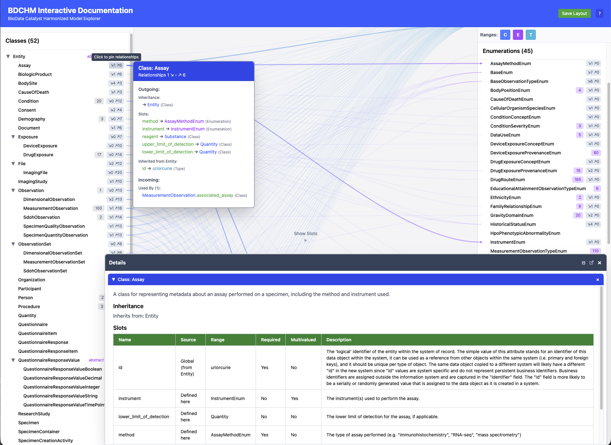

# BDCHM Interactive Documentation: Plans for further development

I spoke with Anne, Corey, Sarah, and Stephanie 2026-04-08 and got a lot of
feedback. There was general consensus that the amount of stuff shown is
overwhelming, even for Corey. 

### Core question
Are the relationships between classes and slots and ranges (type, class, or enum) the primary thing users want to see, or are classes the anchor and relationships are secondary details you drill into?

### Are links worth all the screen real estate they occupy?
- They do have value just for their flashiness, making users feel like they're looking at something fancy
- They do give some immediate sense of structure and how things are connected -- BUT, only if you consider slots and ranges to be important on their own. If you think of slots and ranges as just properties of classes, maybe they don't need elevation to class level in a bi/tri-partite graph display. On the other hand, slot reuse and override is probably of interest, at least to model designers. And we still haven't dealt with Enum hierarchy.

### Clean up interface
- Hide unlightlighted range items
- Have type at top of range panel (fix order to type, enum, class?)
- Make classes start collapsed
- In ranges only include classes that appear as ranges
- Corey says the classes that make sense to start looking at first are conditions, demography and meas obs
- Make table sections collapsible; start collapsed
- Make descriptions in tables collapsible; start collapsed to single line with whole thing in title text (or tooltip)
### New interface ideas
These would be separate SPAs but sharing code where possible. Might consider using features from ../icd11-playground/web so might want to share code across projects.
- **Non-technical user-oriented.** Would be simpler and not use LinkML-specific
    language.
    - Permissible Values / Value Sets instead of Enumeration
    - Something other than classes and slots. Model entities? Properties?
- **Progressive disclosure**
    - Start with classes
    - [Hover/click goes to tabular details display](./tabular-drilldown-mockup.html)
        - Slots
            - Ranges
        - Variables
    - Sarah said something about two views, tabular and then "flow chart
        to hover and see connections," but I'm not sure how that would work.
    - Other things people said that I'm not sure what to do with
        - isolate views
        - base everything on classes as the anchor
        - relationship view and details view
        - start with classes on left and details in middle and get more
        complex from there
- **Another progressive disclosure idea**
    - Have a feature widget or something that includes text about all the different features and allows user to check which ones they want turned on
- **Tabs (not separate SPAs)**
    - Current app could be in "Kitchen Sink" tab

### Features from [ICD-11 Foundation Explorer](https://sigfried.github.io/icd11-playground/) we might want to incorporate
- Contextual help
- Resizable panel layout
- Cross-panel interactions (highlighting, ...)
- Light/dark mode

### Bugs and stuff
Noticed there's no way to see from Observation that it's connected to ObservationSet. And in the other direction, ObservationSet only points to DimensionalObservation -- which I think is the bug that inspired this whole
line of inquiry to decide what to do before fixing. But ObservationSet.observations should point to Observation.

    
# Addressed above
## BDCHM Interactive Documentation: Questions for Stakeholders

We'd like your input on the direction of this tool. Below are some questions
about how you use (or would like to use) the interactive schema explorer, with
screenshots showing current capabilities.

---

## 1. What questions would you like to answer with this tool?

What kinds of things would you want to explore or look up? For example:

- "What data elements does the Observation class contain?"
- "Which classes use GravityDomainEnum?"
- "How are variables distributed across classes?"
- "What slots are shared across multiple classes, and do their definitions differ?"

Understanding your use cases will help us prioritize features.

---

## 2. The two-panel view

The default view shows classes on the left and their ranges (other classes,
enumerations, primitive types) on the right. Lines connect classes to the ranges
used by their slots.

**Figure 1** — Two-panel view showing Entity's relationships to ranges:

Hovering or clicking on a class name shows a summary of its relationships,
and clicking pins a detail panel with full slot and variable information.

**Figure 2** — Hovering on Assay shows its relationships; the pinned detail
panel below shows the class's full slot definitions:

> **Is this view useful for your work?** What would make it more useful?
> Slot names now appear on highlighted links when hovering over a class.

---

## 3. The three-panel (slots) view

Clicking "Show Slots" adds a middle panel that makes the slot connecting a class
to a range visible as a separate item. The links decompose into two hops:
class → slot → range.

**Figure 3** — Three-panel view with all 190 slots listed:

**Figure 4** — Clicking a slot in the middle panel shows its properties and
which classes use it:

> **Is this three-panel view useful?** The slots panel currently lists all 190
> slots in a flat list, which can be hard to navigate. We're considering
> several options:
>
> - **Remove the slots panel entirely** (once slot names appear on the two-panel
>   links, the main information would be available without it)
> - **Group slots under each class they belong to** — though you can already see
>   a class's slots by hovering or clicking the class name
> - **Filter or group by slot category**, e.g.:
>   - Global slots (shared across many classes)
>   - Slots defined on multiple classes with different definitions (overridden)
>   - Slots unique to a single class
>
> If you see value in browsing slots independently of classes — especially
> inherited or overridden slots — we'd like to understand more about how
> you'd use that.

---

## 4. Variables

Classes that map to study variables show them in the detail panel.

**Figure 5** — MeasurementObservation has 100 mapped variables;
Condition has 20. Each shows label, data type, unit, CURIE, and description:

> **Should there be other ways to explore variables** besides viewing them
> through the class they map to? For example:
>
> - A searchable variable list or table
> - Filtering or sorting variables across classes
> - A dedicated variables panel
>
> **Should "variables" for different domains be treated differently?**
> For instance, Condition and Exposure variables are essentially just lists of
> names (uriorcurie type, no units or numeric data types), while
> MeasurementObservation variables have detailed descriptions, units, and
> CURIEs. Would it make sense to present these differently, or is a uniform
> treatment clearer?

What about showing variable data from [priority_variables_transform](https://github.com/RTIInternational/NHLBI-BDC-DMC-HV/blob/main/priority_variables_transform/ARIC-ingest/afib.yaml)
or elsewhere?

---

## 5. Anything else?

Is there anything about the current tool that's confusing, missing, or that
you wish worked differently?

