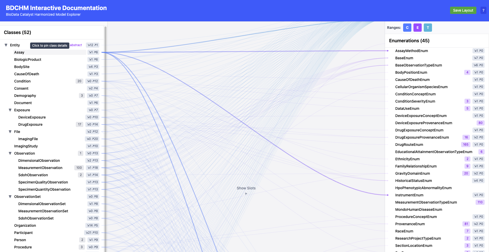
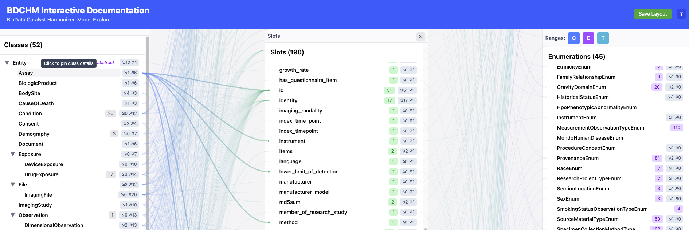
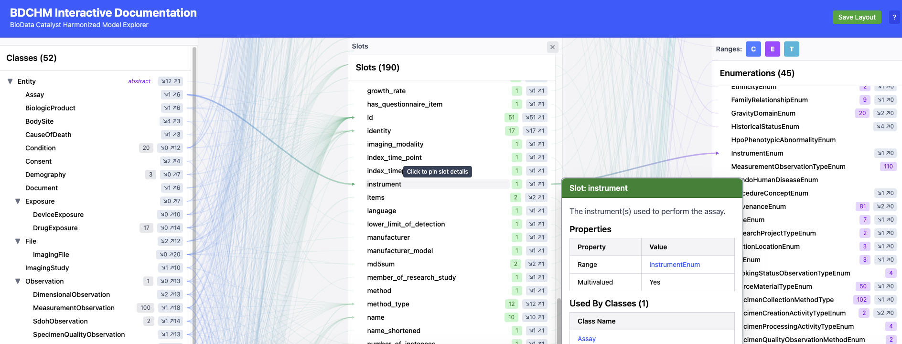
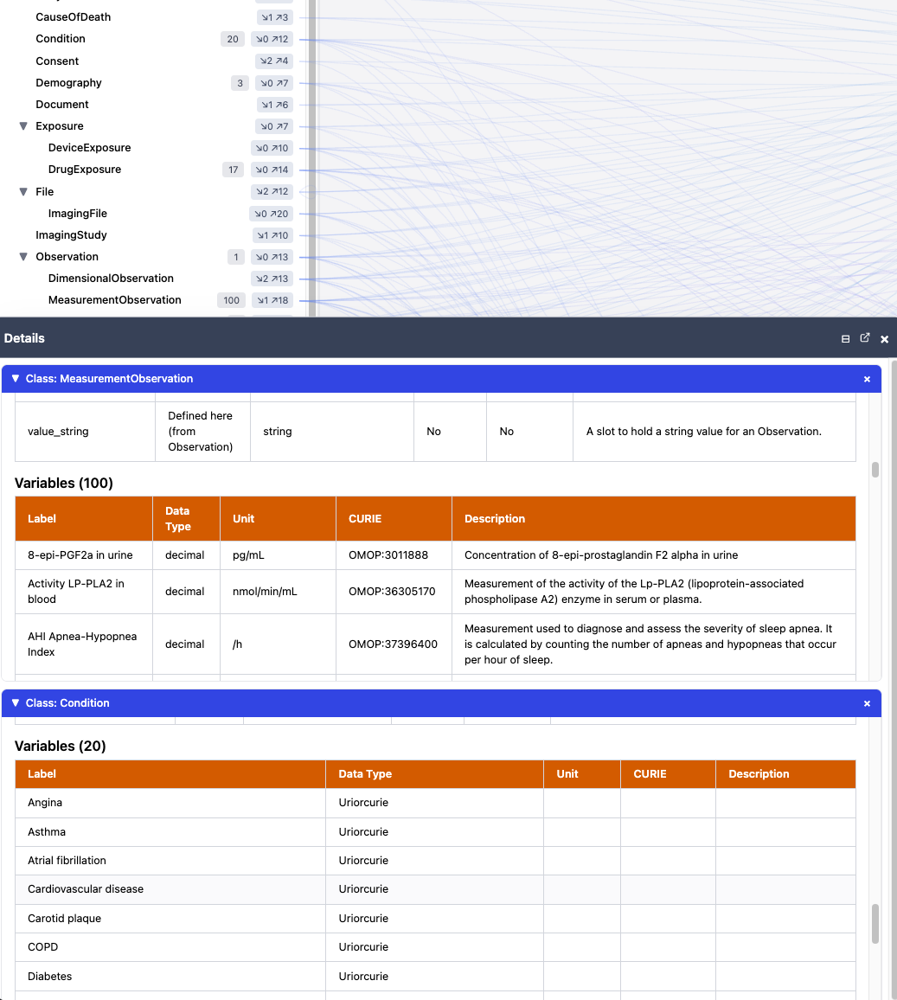

# BDCHM Interactive Documentation: Questions for Stakeholders

We'd like your input on the direction of this tool. Below are some questions
about how you use (or would like to use) the interactive schema explorer, with
screenshots showing current capabilities.

---

## 1. What questions would you like to answer with this tool?

What kinds of things would you want to explore or look up? For example:

- "What data elements does the Observation class contain?"
- "Which classes use GravityDomainEnum?"
- "How are variables distributed across classes?"
- "What slots are shared across multiple classes, and do their definitions differ?"

Understanding your use cases will help us prioritize features.

---

## 2. The two-panel view

The default view shows classes on the left and their ranges (other classes,
enumerations, primitive types) on the right. Lines connect classes to the ranges
used by their slots.

**Figure 1** — Two-panel view showing Entity's relationships to ranges:

Hovering or clicking on a class name shows a summary of its relationships,
and clicking pins a detail panel with full slot and variable information.

**Figure 2** — Hovering on Assay shows its relationships; the pinned detail
panel below shows the class's full slot definitions:

> **Is this view useful for your work?** What would make it more useful?
> Slot names now appear on highlighted links when hovering over a class.

---

## 3. The three-panel (slots) view

Clicking "Show Slots" adds a middle panel that makes the slot connecting a class
to a range visible as a separate item. The links decompose into two hops:
class → slot → range.

**Figure 3** — Three-panel view with all 190 slots listed:

**Figure 4** — Clicking a slot in the middle panel shows its properties and
which classes use it:

> **Is this three-panel view useful?** The slots panel currently lists all 190
> slots in a flat list, which can be hard to navigate. We're considering
> several options:
>
> - **Remove the slots panel entirely** (once slot names appear on the two-panel
>   links, the main information would be available without it)
> - **Group slots under each class they belong to** — though you can already see
>   a class's slots by hovering or clicking the class name
> - **Filter or group by slot category**, e.g.:
>   - Global slots (shared across many classes)
>   - Slots defined on multiple classes with different definitions (overridden)
>   - Slots unique to a single class
>
> If you see value in browsing slots independently of classes — especially
> inherited or overridden slots — we'd like to understand more about how
> you'd use that.

---

## 4. Variables

Classes that map to study variables show them in the detail panel.

**Figure 5** — MeasurementObservation has 100 mapped variables;
Condition has 20. Each shows label, data type, unit, CURIE, and description:

> **Should there be other ways to explore variables** besides viewing them
> through the class they map to? For example:
>
> - A searchable variable list or table
> - Filtering or sorting variables across classes
> - A dedicated variables panel
>
> **Should "variables" for different domains be treated differently?**
> For instance, Condition and Exposure variables are essentially just lists of
> names (uriorcurie type, no units or numeric data types), while
> MeasurementObservation variables have detailed descriptions, units, and
> CURIEs. Would it make sense to present these differently, or is a uniform
> treatment clearer?

---

## 5. Anything else?

Is there anything about the current tool that's confusing, missing, or that
you wish worked differently?
